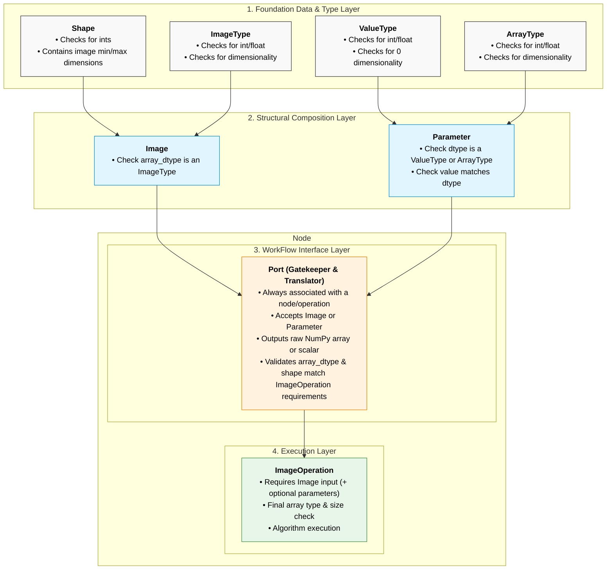
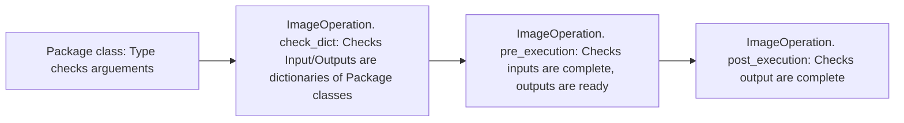

# 1. Document Changelog

|Date		|Version	|Changes Made		|
|:--		|:--		|:--				|
|25/08/26	|0.1.0		|Initial notes on design	|
|26/08/26	|0.2.0		|Added description of project aims|
|27/08/26	|0.3.0		|Added description of DataType classes|
|28/08/26	|0.3.1		|Added description of Shape and Image classes|
|28/08/26	|0.3.2		|Added description of Parameter, ImageOperation and ImageOperation Directory classes|
|01/09/26	|0.3.3		|Added description of backend class structure|
|01/09/26	|0.3.4		|Added description of Node, Port, Connection classes|
|01/09/26	|0.3.5		|Added description of Workflow class|
|03/09/26	|0.4.0		|Added description of UI and UI diagram|
|05/09/26	|0.5.0		|Merged in test plans|
|05/09/26	|0.6.0		|Converted to markdown document|
|05/09/26   |0.7.0      |Added type and shape conversions to description of Image|
|05/09/26   |0.7.1      |Added __iter__ to Shape class and included in unit testing|
|05/09/26   |0.7.2      |Made it explicit in description of Image class that images should always have four dimensions|
|05/09/26   |0.7.3      |Added Image.Unsqueeze to Image class description and unit testing|
|05/09/26   |0.7.4      |Added description of implicit and explicit type conversions to Image DataTypes|
|06/09/26|0.7.5|Added description of class variables to Shape and removed unsqueeze from Image classes|
|07/09/26|0.7.6|Updated description of Shape class to include new definitions of dimensions and class functions|
|07/09/26|0.8.0|Added description of Parameter unit testing|
|08/09/26|0.8.1|Added description of ImageOperation unit testing|
|08/09/26|0.8.2|Added test_sample function to documentation and unit test plans for Type classes|
|08/09/26|0.8.3|added reference to DataTypes.test_sample being given as 0sg|
|09/09/26|0.8.4|Type classes: added description of numpy class variable and changes to to_numpy functions.|
|09/09/26|0.8.5|Parameter class: added shape arguement and updated unit testing|
|09/09/26|0.8.6|Type class: clarified description of use cases of Type classes|
|09/09/26|0.8.7|Parameter Class: Updated unit testing|
|10/09/26|0.9.0|Started major re-write of description of classes, class heirarchy and type checking|
|11/09/26|0.9.1|Re-wrote description of DataType classes to explain base class/child class structure|
|13/09/26|0.9.2|Re-wrote description of Image class and Image unit testing|
|13/09/26|0.9.3|Re-wrote description of Parameter class and Parameter unit testing|
|14/09/26|0.9.4|Re-wrote description of ImageOperation class and unit testing|
|14/09/26|0.9.5|Documented run_code function in ImageOperation|
|15/09/26|0.9.6|Described refactoring of dictionary in ImageOperation to dataclasses and updated unit testing|
|18/09/26|0.10.0|Added description of error handling and logging code|
|19/09/26|0.11.0|Added detail to description of ImageOperation and flow chart|
|19/09/26|0.12.0|Added description of versioning and Changelog.md|
|22/09/26|0.13.0|Added description of LogItem in error_handling.py|
|23/09/26|0.14.0|Updated specification and unit testing for ImageOperationDirectory class|
|24/09/26|0.14.1|Updated unit testing for ImageOperationDirectory class|
|25/09/26|0.14.2|Updated unit testing for ImageOperationDirectory class import testing|
|25/09/26|0.15.0|Updated description of Port class and Port class unit testing|

# 2. Premise and Aims
Over the last 10 years, a lot of my research has been based on image analysis. I have developed my own workflows using one or a combination of FIJI, Python and C#. With the ease of high-definition microscopy at various levels, thorough, repeatable and robust image analysis is becoming more and more important – even with the advent of AI, there will always be a role for classical image analysis. However, getting into analysing your own images can have quite a high barrier to entry. This is exacerbated by some of the weaknesses in the image analysis tools mentioned above:
1.	It’s hard to compare the output to the input, particularly when stringing together multiple steps.
2.	It’s difficult to know what tools are out there – you might think you have complex needs when what you’re trying to do is a solved problem and can be done in a single step.
3.	Particularly when getting into coding for image analysis, it can be very difficult to get different functions to talk to one another. Frequently, the challenge is in understanding how to manipulate the image into the correct format and dimensions for a particular function. Once, you’ve done that, the actual analysis is simple.
With that in mind, I’ve got three main aims to this software:
1.	It needs to be educational by easing users into the image analysis tools that are available.
2.	It needs to be intuitive, with a simple UI where the same actions will always lead to the same effects.
3.	It needs to have a large, well-structured and well-documented list of functions. To aid this, it needs to be easily expandable.
This will be done by allowing the user to use drag-and-drop nodes and connections to draw an image analysis workflow. A pair of input/output images will allow immediate comparison between the original image and the changes at each step.

## 2.1 Educational
To be educational, it should not place unnecessary barriers to learning. This means things like conversions between data types and transposition of dimensions should be dealt with behind the scenes, EXCEPT where they are directly relevant to proper image analysis (for example, trying to do binary processes on non-binarised data).

Feedback should be immediate, so adding a new process into the workflow, or changing a parameter, will update the output image so the user can see its effect.

Image analysis processes will be categorised in such a way that the user can get some idea of what they do before trying them, and documented so that it’s easy to learn what they do and how they work.

You shouldn’t have to do something unrelated to image analysis (ie, learn to code) to analyse images. At the same time, it should provide the tools to develop the user’s ability to use code in image analysis. An end goal is to have the option to export the user’s image analysis workflow to functional, documented python code.
## 2.2 Intuitive

This largely comes down to the UI. It should be simple, with the more complex options present but not in the way, and focussed around the three main elements: the two image windows and the workflow.

It should have the capacity to deal automatically with data conversions that the user doesn’t need to see, while giving hints on how to fix conversions which are required to develop an understanding of image analysis (e.g., how to flatten a z-stack image, how to binarise an image).

## 2.3 Expandable

The ability for the software to organise the workflow should be independent of exactly which image analysis functions are included but should, within reason, work for any function.

This means new functions, with the correct formatting and using the correct classes, should be able to slot directly into the software simply by saving them into the correct folder.

Crucially, adding in a new function should not require messing with the UI or base code.

# 3. System Backend Architecture & Class Structure

The main image analysis workflow will be made up of a series of interconnected nodes, ports and connections. 
Nodes take an input image, carry out a given ImageOperation on that image (based on the input data and any specific parameters provided by the user), and present the adjusted image.

Ports attach to nodes and provide a layer of separation between the functions manipulating the image and the Connections carrying the data between Nodes. In the future, if changes are made to how data is stored and transmitted, this should only require changes to a single Port class, not all the image analysis functions.

Connections transmit images and other parameters between nodes (via ports). They carry out type- and shape-checking on transmitted images to ensure they match what is expected by the next input port, carry out simple shape and type conversions (where required) and prompt the user to adjust the workflow where simple conversions are not sufficient to fit the image to the next node.

ImageOperations are the actual image analysis functions carried out by nodes. They can use existing image analysis libraries (such as scikit image) or custom functions. To allow easy expandability, each ImageOperation is held in its own file which are imported to an ImageOperationDirectory on startup. They also contain definitions of input/output data types and image shape.
To allow consistent data transfer through the workflow, a number of classes are used to define the structure of the data. These include custom DataTypes, and classes defining the image and its shape, and input parameters to ImageOperations. These are used to streamline user input and data transmission, but are not used in actual image analysis, where standard NumPy data types are used.

## 3.1 Interaction between backend classes and frontend UI

The UI is defined in more detail in the Frontend section, but the Backend interacts with the UI in a few main ways. Firstly, users drag-and-drop nodes based on their desired image analysis workflow.

Each node is associated with a given ImageOperation and the parameters of that operation are designed to allow the UI to automatically draw a dialog requesting the required information in a relevant format, without each new operation requiring adjustments to the UI.

They can then draw connections between the nodes. A single node has a defined number of inputs (defined by the ImageOperation) but can output to as many other nodes as required. On drawing the connection, the WorkFlow class checks that the connection can provide an image/value in the proper data type and shape. If so, the ImageOperation is carried out allowing immediate feedback in one of the two image views. If not, and the connection cannot carry out simple shape or type conversions, the user is warned of the problem. Where possible, this warning will provide hints towards available ImageOperations that could be used to fix the problems with the data (for example, carry out a Z-projection to flatten the image). 

## 3.2 Class Hierarchy

The classes are designed as a heirarchy. The base is a foundation layer which define custom data types and provide constraints on values (for example, an integer 8bit image should not contain values above 255 or below 0). These carry out deep checks of all data to make sure it fits that class type, after which higher layers can safely assume data passed to them is of an appropriate format.

The next layer is the composition layer, the Image and Parameter class, which are made up of combinations of the foundation classes to safely define and constrain their values as they are passed through the WorkFlow graph.

The next two layers are both present in Nodes. The WorkFlow interface layer contains the Port class, which sits inside a Node and provides a buffer and translation between the WorkFlow graph and actual image analysis code. The Port layer takes an input from a member of the Composition layer, carries out a final check to ensure it matches the requiered data type, then outpus the data in a standard numpy format (defined by the original foundation data class).

The final layer is the execution layer, which also stands slightly outside the other layers. This layer is purely involved in execution of image analysis code. As such, it doesn't receive or send data using data types from the other layers, but works in standard numpy data types. However, it does define the expectations for inputs and outputs in terms of foundation layer data classes, to safely manage communication with the DataFlow graph, via ports.

This heirachy does not explicitly define the roles of the Connection, Node and WorkFlow classes in defining the WorkFlow graph. This is described in more detail in the WorkFlow section.

## 3.3 Foundation Classes

### 3.3.1 DataType classes

The aim of the DataType classes is to allow data to be transferred through the WorkFlow in a reliable and predictable way.

Data can **only** be passed through the WorkFlow as a DataType class - equivalent types such as np.uint8 or np.float64 **will** result in type errors.

This is a deliberate design choice to maintain control and consistency in how data moves through the WorkFlow.

A distinction should be made between data transferred through the WorkFlow and data used for image manipulation in members of the ImageOperation class. Input and output data to ImageOperations will be in **defined** numpy equivalents to DataType classes. The conversion from DataType classes to their numpy equivalent will take place in the Port for each input and output. This means image analysis can be carried out using standard types and functions, and there is no requirement for data manipulation using the DataType classes. 

While image manipulation is carried out using standard Numpy types, DataTypes are still used to define the format of expected inputs to and output from ImageOperations.

The interaction between DataTypes, Ports and ImageOperations will be described in more detail in the Port and ImageOperation class descriptions.

DataTypes are all based on a defined base class, BaseType. This defines the characteristics of a custom data type with the following variables. The first three variables are required - the class types will not function without them and will fail unit testing. The remaining four variables are optional:

* data_type - this provides a reference to this DataType in the DataType enum in constant.py
* numpy - the defines the equivalent numpy data type (eg np.uint8, np.bool, np.float64)
* allowed_sub_types - a tuple of allowed data types (eg np.integers, bool, numbers.Number)

* description - text description of class and what its for
* min_value - if the value must be with a range, this defines a minimum value (default is None)
* max_value - maximum allowed value, if defined (default is None)
* is_array - type classes must define as either a 1d or multi-dimensional data type (default is False)

By default, seven custom data types are defined. Three are used to define images, two to define 1D variables and two to define non-image arrays:

* ImageInt - For images stored as integers in the range 0 ≤ int ≤ 255
* ImageFloat - For images stored as floats in the range 0 ≤ float ≤ 1
* ImageBinary - For binarised images. Stored as integer 0 or 1, will accept boolean values.

* ValueInt - For 1D integer variables
* ValueFloat - For 1D float variables

* ArrayInt - for multi dimensional integer variables
* ArrayFloat - for multi dimensional float variables

Note again that these data types are for transferring data through the WorkFlow, for example an image threshold value may be transmitted from one node to the next as a ValueInt. They are not expected to be used in any code unrelated to data transfer.

For new DataTypes, conversion between types will result in a NotImplementedError. To fix this, implement a custom to(self, dtype) function in your custom class defining the possible conversions.

By default, each ImageType can be converted to each other. Likewise ValueTypes and ArrayTypes can be converted to other members of the same type.

Where the 'to' function has been implemented, conversions can be explicit (eg, by using ImageInt.to(DataType.ImageFloat)) or implicit (eg, by calling ImageFloat(x) where x is an ImageInt).

Each Image type has __init__, value property and value.getter functions along with conversion functions for the other two image types and the relevant standard numpy type. For numpy conversion, this will be available as an explicit function (to_uint8 or to_float64) or as a generic function (to_numpy).

The comparable numpy data type is stored in the numpy class variable. This is used in the to_numpy function and for type checking once the DataType class has been converted to a standard numpy class for image analysis in a Port.

~~Each DataType includes a test_sample() function, which creates a variable of that type for testing and providing default values. This can be generated as random numbers (for testing) or 0s (for instantiating default input and output variables for ImageOperations, if zero = True - by default, zero = False).~~

All DataTypes will be wrapped in an Enum to help ensure type safety, to simplify access from other classes and to simplify refactoring if data types need to be changed in the future. Within the Enum, data types are specified into groups image_type and value_type. For each type, the data_type class variable **must** point to the relevant name in the Enum (stored in constants.py).

### 3.3.2 Shape class

This exists to hold data related to the shape of transmitted images. It will hold integer values for:
* c (channels)
* z (depth)
* y (height)
* x (width) 

And contains class variables to define limits on image Shape:

* max_image_dimensions - the max number of dimensions an image should have (4).

* min_image_dimensions - the minimum number of dimensions an image should have. This is currently set at 4, the same as max, to allow for consistent expectations for image processing. Un-used dimensions should have size 1.

* dimensions- the current dimensions and default order (c, z, y, x). This is in the form of a tuple defining the order, used in the __iter__ and __getitem__ dunders below.

Shape has __iter__ dunder to return values in the order defined above, __getitem__ and __setitem__ dunders to return and set values and __copy__ and copy() functions to allow copying. __getitem__ and __setitem__ accept and return values as either strings (c,z,y,x) or integer indices (0,1,2,3 - as defined by order in dimensions).

Shape also has functions to convert between dimensions in string and integer formats.

Shape will be used to hold shape related information in a number of classes and contexts:

* Image class – this will reflect which dimension of the multi-dimensional array holds which dimension of the image.
* ImageOperation class:
    1.	Constraints on input – does the operation need a specific shape (eg Z = 1 for a flat image) or accept any size for a specific dimension (in which case, -1 is used).
    2.	Effects on output – what effect an operation will have on the image shape, for example Z-projection will result in a Z of 1, while other dimensions will be left unchanged (-1).
* Node and Port classes – this will mirror the usage in ImageOperation classes
* Connection class – this may be required to reshape the image from the shape given by the input port to the shape given by the output port.

## 3.3 Composition classes
### 3.3.1 Image Class

This holds the image data as a multi-dimensional array, with max and min dimensions defined in the Shape class.

The Image class exists purely to hold images for input to and output from ImageOperations within Nodes. Members of the Image class are instantiated on the creation of the Node and ImageOperation initially as arrays of 0s of the defined size and type. This means that, for each Image, the shape and data type of the pixel array is pre-defined and invariate. Any changes to the Image class which do not match the requirments of the attached Port will result in an error.

Therefore, the image data can be described with two instance variables:

1.	pixel_array: Contains Image pixel data, in a multi-dimensional array of defined size and type.
2.	image_map: Mapping from image dimensions (C, Z, Y, X) to image array dimensions (0,1,2,3) using Shape class.

### 3.3.2 Parameters Class

Similar to the Image class, the Parameter class does not exist independently of a Node/Port. 

It contains non-image inputs/outputs for ImageOperations, including non-image values passed from other nodes via the WorkFlow and values passed from the UI based on user input.

Parameter also includes the option to specify UI elements to fetch parameter values from the user. The aim is, where user input is required, to have the necessary information for the frontend to automatically create a dialogue box for the user to enter values, without each ImageOperation requiring its own hardcoded UI elements.

* Name – the name of the parameter
* value – its value (initialised as correct data_type/shape (if required) by Port on instantiation therefore also defines required data type)
* ui_element – the desired UI element for input, where relevant (text box, drop down box, check box, slider etc)
* ui_element_options – Dictionary of other options related to that UI element, where relevant (slider min/max, drop down box options etc).

Type checking is carried out on dtype, to ensure its a member of DataType.value_types or DataType.array_types.

## 3.4 Execution Classes
### 3.4.1 ImageOperation Class
The ImageOperation class is responsible for carrying out functions that carry out analysis on images. A key aim of this project is expandability and to allow the inclusion of new image analysis functions with no need to edit the base code. To achieve this, each image analysis function will be a separate file written as an instance of the ImageOperation class, containing all the information required to run the function and will be imported using imagelib. 

The previous classes described have been primarily related to the flow of data through the WorkFlow graph and have defined custom class types to make sure this happens in a controlled manner. The ImageOperation sits slightly outside this class structure, as existing image analysis modules work in standard or numpy classes. To allow ImageOperations code to be designed and executed in a standard manner, inputs and outputs from ImageOperations are in standard Numpy data types (for conversion from custom DataTypes to Numpy, see Node and Port classes).

The expected inputs and outputs will still be described in terms of DataType classes, as these classes also define their own Numpy equivalents.

The ImageOperation class will contain the following variables:

* name: name of ImageOperation
* category: logical category (“Threshold”, “Filter” etc) - defined by folder location of file
* input and output dictionaries (note: each of these variables will be instantiated as a dictionary, either of a Package class or empty if None is passed):
    - input_image: input images as dictionary of ImagePackage class
    - input_parameter: other inputs as dictionary of ParameterPackage class         
    - output_image: Output images as dictionary of ImagePackage class
    - output_parameter: other outputs as dictionary of ParameterPackage class 
* docs – documentation to explain function, effects, parameters etc
* alerts – any warnings to user (e.g, “Background subtraction with a large radius is a very slow process”)
* version – version of software code ImageOperation was written for. This is to future proof code, so changes to base code that affect ImageOperations don’t mean all existing ImageOperations need to be rewritten. 
* execute – function with compiled code to execute - gathered from input .py files by ImageOperationDirectory

Because this class takes input directly from external files there are a number of checks made on that data:

Firstly, data on expected inputs and outputs are entered into a PackageClass, either ImagePackage for images or ParameterPackage for other input/output values. This requires a defined data type for that variable from the DataType enum. Where other parameters (the value itself, any shape parameters to define it) it will also check their type, but these aren't required until a later stage. Note that, on instantiation, the inputs and outputs will have defined data types but no actual data.

Next, ImageOperation, the setters for InputImage, InputParameter, OutputImage and OutputParameter run check_dict() which checks that each arguement is a dictionary of the relevant package class.

The bulk of the checks are carried out when run_code is called to execute the code, which calls the pre_execution function. This checks that all inputs are present and correct (eg, input image pixel array matches defined shape) and that the required output arguements are present to describe the outputs (dtype and shape).

Finally, following code execution checks are carried out to ensure that the output is complete and correct.

**NOTE: At this point, any ImageOperation requires (at least) one image as an input. This is a design decision to prevent creep and bloat, based on the idea that as soon as only non-image variables are accepted this software is moving into data analysis rather than image analysis. This is checkedby the run_code function in ImageOperation and will therefore also affect other classes interacting with ImageOperations (Nodes and WorkFlow).**

### 3.4.2 ImagePackage
Simple class holding data for image inputs and outputs from ImageOperation. Contains:
* dtype - set at instantiation based on ImageOperation code file.
    - Type checks for member of DataType
* shape - set at instatiation based on shape constrains defined in code file. **NOTE: this is not the shape of the array (which is defined by the array) - it is the <u>constraints</u> on the shape of the image.**
    - Type checks for Shape class
* pixel_array - set to None at instantiation, given value as relevant for WorkFlow. Expected to contain ndarray of dtype.numpy.
    - Type checks for Shape class
* mapping - set to None at instantiation, given value of type Shape mapping image dimensions to pixel array dimensions.

### 3.4.3 ParameterPackage
Simple class holding data for non-image inputs and outputs from ImageOperation. Contains:
* dtype - set at instantiation based on ImageOperation code file.
    - Type checks for member of DataType.
* value - set to None at instantiation, given value as relevant for WorkFlow. Expected to contain value of dtype.numpy.
* shape - if dtype defines an array_type, contains a np.array defining shape of value.
    - will accept a tuple, list or np.ndarray. Tuples and lists will be converted to np.ndarray.

### 3.4.4 ImageOperationDirectory Class
This class holds for a list of all ImageOperation classes, along with the code required to import them.

ImageOperations are imported from a directory defined in the ImageOperationDirectory class, currently .\backend\image_operations. 
Modules in child folders of image_operations are imported, but not at greater depth. Child folders define the category of contained ImageOperations. The category name should be saved in __init__.py as category = "string".

ImageOperationsDirectory can be passed two arguements. Log provides a list of LogItem class from error_handling.py and makes up a log of error messages. If this is not passed, a new list will be created. Test (default = false) is a flag for testing ImageOperationsDirectory. If test == true, only files within image_operations/testing folder will be imported. If testing == false, files within image_operations/testing folder will not be imported.

The proper format for ImageOperation files is described in the ImageOperations Files section.

Files are first checked for any imports that are not permitted by the allowed_imports variable, currently stored in the ImageOperationDirectory class.

Files are then checked for their version, in the format "version = x.y.z". This defines the API version for which they are designed and is used to ensure the correct import function is used to keep backward compatibility.

Where a version is found, ImageOperations are imported into the ImageOperation class.

They are then tested using the core.type.sample_data function, which provides sample input data in the required format defined by the ImageOperation.
Note that, for now, inputs are provided as variables or arrays of 0s, to avoid situations where a random value may be outside a required range. However, a potential future point of failure is if 0 is not a valid value for a particular input. In future, this could be avoided by implemented min and max values to the sample_data function.

If testing is sucessful, files are added to a dictionary of ImageOperations with a key of the filename without py (**TODO: address potential failure with identical filenames**). The category and version number will be added to each ImageOperations based on file and folder parameters. 

## 3.5 Interface Classes

### 3.5.1 Port Class

The port class acts as a buffer between a Node and an ImageOperation. It has two main roles: 
 * to convert between data types used for transmitting data through the WorkFlow and those used for image analysis.
 * to make sure that future changes can be made to the overall WorkFlow without impacting on the data sent to ImageOperations 

Two lists of ports are created with each node, and ports do not exist independently of nodes. Each port has the instance variables:
* node_id – unique identifier for connected node
* connection_id – unique identifier for connected connections
* is_node_input – flag for whether port is an input or output. Inputs only allow one connection, outputs allow multiple
* image_operation_ID - connected image operation input/output
* input - the inputted data
* output - the outputted data

It has a single main function for data conversion:
* convert()

### 3.5.2 Node Class
The ImageOperation class defines the image analysis function to be carried out on the image. The Node class is responsible for positioning an ImageOperation in the WorkFlow – this means there can be multiple nodes containing the same ImageOperation. While the ImageOperation class is responsible purely for image analysis, the Node class is responsible for interacting with other elements of the WorkFlow. As such, it has the following instance variables:
* image_operation – the image analysis function to be run, as an ImageOperation class
* output – Image or value holding output data from the ImageOperation
* Various flags:
    - is_ready – whether the correct inputs have been connected allowing the ImageOperation to be run.
    - needs_update – whether this node needs to be (re)run, either because it hasn’t been run yet or because an upstream node has been changed.
* input_ports – a list of members of the port class defining the required inputs to the node.
* output_ports – a list of members of the port class defining the presented output(s) from the node.

Node instantiation:
1: Create Node and node ID
2: Add ImageOperation to Node
3: Add Ports to Node based on input and output requirements of ImageOperation

Node running:
1: run ImageOperation code with inputs from input Ports
2: send ImageOperation output to output Ports

### 3.5.3 Connection Class

Connections form the links between nodes and ports through which data travels through the WorkFlow. They have a defined direction, with an input and an output, and are created by the user. On their initiation, type and shape checking are carried out by the WorkFlow (explained in more detail below). If they find a simple type or shape conversion can be made, they will do so, and if not, they will prompt the user to make changes to the WorkFlow. They will be discarded if both ends of the connection are not appropriately typed/shaped. Connections only contain two instance variables:

* input_port_id
* output_port_id

## 3.6 WorkFlow Class

The WorkFlow class does the bulk of the work in initiating, defining and checking the graph through which image data flows.
It contains lists of all existing nodes, connections and ports, contains functions to safely add, edit and remove new nodes, ports and connections.

On creation of new nodes, it interacts with the frontend to get node parameters.

On creation of new connections, it checks the validity of those connections and, if necessary, gives feedback to the user.
It defines the starting node in the graph, allowing it to generate upstream and downstream paths through the WorkFlow.
It contains instance variables:

* nodes – dictionary of all extant nodes by unique ID
* ports – dictionary of all extant ports by unique ID
* connections – dictionary of all connections by unique ID
* starting_node – ID of starting node

It also contains the following functions:
* get_downstream_nodes
* get_previous_node
* get_next_node
* node_create
* node_edit
* node_remove
* connection_create
* connection_edit
* connection_remove
* port_create
* port_edit
* port_remove
* Transpose - tranposes pixel_arrays passing through the graph, given requirements of input and output Ports. Previously part of Image class./
* Squeeze/unsqueeze - changes array shape, as Tranpose.

On creation of a new connection, it will check for structure, constraint or type violations. Where these can be fixed through image type or shape changes, it will do so, otherwise it will prompt the user to adjust the WorkFlow. 

## 3.7 Error Handling

error handling.py holds functions and classes that allow reporting of errors to an external log (with the future potential to pass to a UI dialog).

It contains the LogItem class, which holds data for adding to the log. It includes:
- time
- error: the BaseException class defining the error type
- message: the associtaed error message
- class_name: the class that logged the error
- function_name: the function that logged the error
- import_name: the imported ImageOperation file which caused the error. Defaults to None.

It also contains a custom function, log() that reports errors and returns the associated LogItem describing the error.

Exception chaining will be used to log errors in the WorkFlow layer and ImageOperationDirectory, but not lower layer classes (see class heirarchy).

For now, error messages are simply printed. This will be developed to saving to a log file and user prompts as development progresses.

# 4 System Frontend and UI

 
1.	Input* image view
2.	Output* image view
3.	Workflow view
4.	Z-slice selector if Z-stack and mouse-over
5.	Lock the windows – if windows are locked, changes to zoom/pan on one effects the other – otherwise, can move and zoom independently.
6.	View node toggle
7.	Add connector button
8.	Node view, categorised by tabs
9.	Menu bar
10.	Channel options view toggle (allows selection of LUTs, what channels are visible etc)

*both views can be toggled to view the outputs of other nodes by clicking the node (for the output view) or shift-clicking the node (for the input view). Zoom using mouse wheel, double right clicking/left clicking. Pan by dragging and/or scroll bars. 
# 5 Development Plan
## Stage 0 - Planning
* Plan overall design.
* Plan class structure.
* Plan graph flow.
* Plan main UI elements.
* Set up project and directory structure for development and testing.
## Stage 1 - Backend
### Stage 1.1 – Backend Foundation and Composition Classes
* Plan unit testing for DataType, Shape, Image and Parameter classes.
* Implement DataType, Shape and Image and Parameter classes.
* Test DataType, Shape and Image and Parameter classes.
### Stage 1.2 – Backend Execution Classes
* Plan unit testing for ImageOperation and ImageOperationDirectory classes.
* Implement ImageOperation and ImageOperationDirectory classes.
* Test ImageOperation and ImageOperationDirectory classes.
### Stage 1.3 – Backend Interface Classes
* Plan unit testing for Port, Node and Connection classes.
* Implement Port, Node and Connection classes.
* Test Port, Node and Connection classes.
### Stage 1.4 – Backend Workflow Class
* Plan unit testing for Workflow class.
* Implement Workflow class.
* Test Workflow class.
## Stage 2 - Frontend
### Stage 2.1 – Frontend Planning
* Detailed plans for frontend from initial overview.
* Plan implementation of frontend.
# 6 Testing
## 6.1 – Backend Foundation Classes
### 6.1.1 DataType
**BaseType**
|Component  | Test  | Expected Outcome  | Undesired Outcome |
|:--        |:--    |:--                |:--                |  
|allowed_subtypes | Use test value of type where type not listed in allowed_subtypes | Type Error | No type error |
|is_array validation | Enter [1, 2] to data type expecting scalar values | Type Error | Data accepted |
|is_array validation | Enter 2 to data type expecting list values | Type Error | Data accepted |
|Array shape | Enter multi-dimensional array to type expecting multi-dimensional array | Array maintains shape | Array shape changed |
|Min/Max bounds | Enter value above max_value | Value Error | Value accepted |
|Min/Max bounds | Enter value below min_value | Value Error | Value accepted |
|to_numpy| Convert value using to_numpy function | Expected value of correct type | Incorrect value Incorrect type |
|Immutability | Modify original input list after instantiation of array data type | Value doesn't change | Value does change |
|Immutability | Modify original input np.array after instantiation of array data type | Value doesn't change | Value does change |
|Immutability | Modify original input value after instantiation of scalar data type | Value doesn't change | Value does change |
|Immutability | Modify original numpy type value after instantiation of scalar data type | Value doesn't change | Value does change |

**Every child class** 
|Component  | Test  | Expected Outcome  | Undesired Outcome |
|:--        |:--    |:--                |:--                |  
|Required class variables | Test that DataType.numpy, DataType.allowed_sub_types and DataType.data_type are not None | Test pass| Test fail |

**Every conversion of every child class**
|Component  | Test  | Expected Outcome  | Undesired Outcome |
|:--        |:--    |:--                |:--                |  
| Output type | Output type matches dtype arguement following explicit conversion using (.to(dtype))| Test pass| Test fail |
| Output type | Output type matches dtype arguement following implicit conversion (dtype(value))| Test pass| Test fail |
| Output value | Output value matches dtype arguement following explicit conversion ((.to(dtype))| Test pass| Test fail |
| Output value | Output value matches dtype arguement following implicit conversion (dtype(value))| Test pass| Test fail |
| Value drift | Carry out repeated conversions between data types| No drift in values| Drift in values |

**sample_data**
|Component  | Test  | Expected Outcome  | Undesired Outcome |
|:--        |:--    |:--                |:--                |  
|dtype checks | Input value of non DataType type    |Type error |Value accepted| 
|shape checks | Input value dtype where is_array = true but no shape passed   |Type error |Value accepted| 
|shape checks | Shape passed, but not as np.array, tuple or list   |Type error |Value accepted| 
|shape checks | Shape passed, but not as array of integers   |Type error |Value accepted| 
|type checks| Input value of DataType type | Output of expected type | Output of different type|
|shape checks | For array dtype, does output have expected shape with randomized values | Shape matches shape arguement | shape doesn't match shape arguement|
|shape checks | For array dtype, does output have expected shape with 0 values | Shape matches shape arguement | shape doesn't match shape arguement|
|value constraint check | For array dtype with min, max values, do random values conform to min and max | values conform | values out of range/value error from underlying type |

### 6.1.2 Shape
|Component  | Test  | Expected Outcome  | Undesired Outcome |
|:--        |:--    |:--                |:--                |  
|Type constraints	|Insert wrong type	|Type Error	| Type converted to correct type Wrong type ignored|
|Immutability|Input values based on variable then change variable |Values in DataType do not change|Values change|
|Itterability|Test iteration|Iteration returns correct values|Iteration returns incorrect values|
|get_item|Test getting items using either index or dimension string| returns correct values|Returns incorrect values|
|set_item|Test setting items using either index or dimension string| Sets correct values|Sets incorrect values|

## 6.2 – Backend Composition Classes

### 6.2.1 Image
|Component  | Test  | Expected Outcome  | Undesired Outcome |
|:--        |:--    |:--                |:--                |  
|Type constraints|	Use unexpected data type (not ImageInt, ImageFloat or ImageBinary)|	Type Error	| Type converted to correct type Incorrectly type data used anyway</li></ul>|
|Shape constraints	|Insert input array with more or less than min/max dimensions defined in Shape.py |Value Error	|	Wrong shape array accepted|
|Shape constraints	|Input shape data not in Shape class|Type Error	|	Wrong class ignored|
|get_image_shape() | Get image shape of various shape pixel arrays | Gives correct shape | Gives incorrect shape |

### 6.2.2 Parameters
|Component  | Test  | Expected Outcome  | Undesired Outcome |
|:--        |:--    |:--                |:--                |  
|Type constraints|	Input data type not a member of DataType.value_type|	Type Error	| <ul><li>Incorrect type accepted</li></ul>|

## Stage 6.3 – Backend Excecution Classes

### 6.3.1 ImageOperation
|Component  | Test  | Expected Outcome  | Undesired Outcome |
|:--        |:--    |:--                |:--                |  
|ImageParcel|Supply **dtype** as not member of DataTypes.image_types| Type Error | Incorrect data type accepted|
|ImageParcel|Have **pixel_array** type not match dtype| Type Error | Incorrect data type accepted|
|ImageParcel|Supply **shape** not as Shape class| Type Error | Incorrect data type accepted|
|ImageParcel|Supply **mapping** not as Shape class| Type Error | Incorrect data type accepted|
|ImageParcel Imutability|Pass value as variable then change variable| ImageParcel value remains the same | ImageParcel value changes|
|check_data|Supply input_image/output_image/input_parameter/output_parameter not as a dictionary| Type Error | Incorrect data type ignored|
|ParameterParcel|Supply **dtype** as not member of DataTypes.value_types or DataTypes.array_types| Type Error | Incorrect data type accepted|
|ParameterParcel|If array is expected, have **value** not a list, tuple or ndarray| Type Error | Incorrect data type accepted|
|ParameterParcel|Have **value** type not match dtype| Type Error | Incorrect data type accepted|
|ParameterParcel Imutability|Pass value as variable then change variable| ParameterParcel value remains the same |ParameterParcel value changes|
|run_code|Try to execute run_code with no compiled_code or compiled code in wrong format (not types.codetype)| Type Error |Proceeds without error|
|run_code|Don't supply a value for input_image | Value Error | Code tries to continue|
|run_code|Supply input_image with mising pixel array | Value Error | Incorrect pixel array accepted|
|run_code|Supply input pixel_array with missing mapping or shape data| Value Error | Incorrect pixel array accepted|
|run_code|Supply input pixel_array where shape does not match constraints in shape| Value Error | Incorrect pixel array accepted|
|run_code|Supply input_parameter with mising value | Value Error | Incorrect pixel array accepted|
|run_code|Supply parameter array where array does not match defined shape| Value Error | Incorrect value accepted|
|run_code|Try to run with missing output definitions (shape for images or arrays, dtype for any output) | Value Error | runs code anyway|
|run_code|Code provided creates an error|Error|No error passed on|
|run_code|Code provided doesn't create an output|Runtime error|No error passed|
|run_code|Code provided changes inputs|Runtime error|No error passed|
|run_code|Code provided returns a pixel_array without mapping data| Value Error | Incorrect value accepted|
|run_code|Code provided returns a pixel_array with shape that doesn't match mapping and shape constraint data|Value Error|Incorrect value accepted|
|run_code|Code provided returns an array value without shape data| Value Error | Incorrect value accepted|

### 6.3.2 ImageOperationDirectory
|Component  | Test  | Expected Outcome  | Undesired Outcome |
|:--        |:--    |:--                |:--                |  
|ImportList|Import ImageOperation with correct category| Correct category saved to ImageOperation | Incorrect category|
|ImportList|Test ImageOperation with no/incorrect version number|  ImageOperation rejected and reported | ImageOperation accepted|
|ImportList|Import an ImageOperation that should not be accepted because of missing arguements| ImageOperation rejected and logged | ImageOperation accepted|
|ImportList|Import an ImageOperation that should not be accepted because of invalid arguements| ImageOperation rejected and logged | ImageOperation accepted|
|ImportTesting|Test loading an ImageOperation with no input_image| ImageOperation rejected and logged | ImageOperation accepted|
|ImportTesting|Test loading an ImageOperation with non-functioning code (code returns error)|ImageOperation rejected and logged | ImageOperation accepted|
|ImportTesting|Test load an ImageOperation which produces an image output in the wrong format(not ImagePackage)|ImageOperation rejected and logged | ImageOperation accepted|
|ImportTesting|ImageOperation which produces a parameter output in the wrong format (not ParamaterPackage) |ImageOperation rejected and logged | ImageOperation accepted|
|ImportTesting|Test load an ImageOperation which produces an image output in the correct format with a missing pixel array|ImageOperation rejected and logged | ImageOperation accepted|
|ImportTesting|Test load an ImageOperation which produces an image output in the correct format with missing mapping data|ImageOperation rejected and logged | ImageOperation accepted|
|ImportTesting|Test load an ImageOperation which produces an image output in the correct format with incompatible shape and mapping data| ImageOperation accepted|
|ImportTesting|Test load an ImageOperation which produces a parameter output in the correct format with a missing value|ImageOperation rejected and logged | ImageOperation accepted|
|ImportTesting|ImageOperation which only produces an image output|ImageOperation accepted | ImageOperation rejected|
|ImportTesting|ImageOperation which only produces a parameter output|ImageOperation accepted | ImageOperation rejected|
|ImportTesting|ImageOperation which produces a parameter and image output|ImageOperation accepted | ImageOperation rejected|
|ImportConstraints|Import an ImageOperation with unacceptable import|  ImageOperation rejected and reported | ImageOperation accepted|
|ImportConstraints|Import an ImageOperation with acceptable import|  ImageOperation imported | ImageOperation accepted|

## 6.4 Backend Interface Classes
### 6.4.1 Port Class

|Component  | Test  | Expected Outcome  | Undesired Outcome |
|:--        |:--    |:--                |:--                |  
|Convert|Provide numpy data to Node flagged as node_input| Type error: expects DataType| Accepts Data|
|Convert|Provide DataType data to Node flagged as !node_input| Type error: expects numpy| Accepts Data|
|Convert|Provide DataType data to Node flagged as node_input| Correctly converts to numpy data type | Fails to correctly convert data|
|Convert|Provide numpy data to Node flagged as !node_input| Correctly converts to relevant DataType | Fails to correctly convert data|

# Versioning

Versioning and changelogs are implemented using the "keep a changelog" 1.1 format (https://keepachangelog.com/en/1.1.0/).

This is unit tested for __version__ existing in __init__.py in the core directory, and that the version number complies with semantic major.minor.patch versioning.

For now, version checks within the code are limited to the ImageOperationDirectory class, which checks the version number in imported modules to use import code that corresponds to the ImageOperation class structure at that defined version.

## 8 Other Notes
* Changes to image shape should always be explicit, never incidental. For example, z-projection will reduce z dimension to 1 because that’s what z projection does, but thresholding a 5 slice z-stack will output 5 thresholds, not just 1.
* Function code does not deal with type changes, checking of types, displaying images, UI input. The role of each function is purely to take its defined input, process it according to the supplied parameters, and produce an output in defined shape. As part of this role, it should include error handling to minimise/deal with possible errors (with the assumption that the input is of the required format). 
* To allow for simple additions of new functions without affecting the base code, each function will be in a separate module. Along with the code itself, this module should include other data required to integrate into the software (definitions of parameters required, input and output data types, input and output image shape) and documentation (what the function does, how it affects the image shape, how changes to parameters affect output, any other points of interest). 
* Type checking etc will be carried out by the pipeline functions, along with checking that the input and output image shapes are as expected.
* Functions can have multiple outputs, but defined inputs. For example, a z-stack could have one output getting z-projected, another getting processes slice by slice etc, but two images could not enter the same z-projection function. Some functions may require multiple inputs, eg applying a threshold will require thresholds and an image to apply thresholds to.
* Some thought is going to have to be given to how to deal with segmented images. Are segments treated as an image of size y * x with integer values defining segment locations? Is each segment treated like its own sub-image (like channels or z-slices)? Is a segmented image treated as the original image with an added layer defining the segments? Leaning towards the first option, but the other options may have advantages in specific situations.
* Some type changes should be dealt with automatically (ie, int to float). Some type changes should be highlighted to user as a flaw in the workflow (ie, trying to carry out a binary process on a non-binarised image) with pointers on how to fix the issue).
* It should be possible to add new functions without programming new UI elements. The data included with a function must be sufficient to automatically generate a UI element for the user to enter the required parameters.
* If its educational, it needs documentation. Consider whether this should be included as a string within any new function or as a separate file.
* The UI should be unintimidating. Consider what is necessary to see (input image, output image for comparison, channel and slice controls, current workflow diagram) and what can be hidden except when needed (LUTs, adding functions, changing function parameters, defining channel image parameters (channel names etc)).
* One of the challenges of image analysis I would like to simplify here is making sure an input image to a function is in the right format. Transposition of shape (eg, 3*1024*1024 image to 1024*1024*3 image) and data type (int to float) will be handled automatically. The user will be responsible for making sure a function that requires a 1*1024*1024 image doesn’t get sent a 3*5*1024*1024 image. For this to be intuitive, each function must have a clearly defined and invariable effect on image shape (eg, z-projection will reduce Z to 1. Isolating a channel will reduce channels to 1 or conversely, z-projection won’t affect channels so channels in = channels out). This allows the user to clearly see what effect each function has on the shape of the image, and also allows the software to give pointers (ie, if the user is trying to squeeze a 3 * 1024 * 1024 image into a function that requires a 1 * 1024 * 1024 image, or an integer image into a function that requires a binarized input, highlight potential functions that can be used to fit the image to the required shape).
* Implement a “pause updates” button – if the node graph gets big, make it possible to update multiple nodes then update all the images, rather than doing it repeatedly.

### 7.1 Class design notes
* Dimension class:
o	In images, need to know which dimension of the np.array holds C or Z.
o	Therefore image_shape class has c_dim, z_dim, y_dim, x_dim
o	Image class itself needs to be able to iterate through c, iterate through z, iterate through y and iterate through x.
o	The images returned form these iterations need their own image_shape class (i.e, an image iterated through z slices will have an image_shape class with z = -1 - so can then iterate through channels and so on.
o	The output from a function will be an image, this will have its own image_shape class so that role of a function is dealt with here.
o	The constraints on a node will also use this class. Node inputs can be "I need 1 channel, I don't care about x, I don't care about Y, I don't care about z" - this can fit into image_shape class as C = 1, y = x = z = -1.
o	This will also fit for outputs, given currently anticipated effects that a function will have. Either output dimensions are the same or they are reduced to 1. So outputs could be "-1" for no change or "1" for changed to 1, "2" to changed to 2. There’s a slight possibility of needing to use strings for other operations “-3” or “/6” etc, at which point this class may need rethinking.
* Workflow class:
o	Plans for defining graph topology of the workflow are to match the way they would be added in the UI. First, a node (e.g., node 2) would be dragged into the workflow; this would add the node to the workflow class as a workflow element, but with no input or output connections specified. Next, the user would connect the node to the preceding node (node 1). At this point a function would be called within the workflow class to check what type conversions might be needed (in pseudo code, node2 input = int(node1 float output)) or whether there were larger problems with the input to node 2 that might need the user to add in intervening nodes to further process the data. If the function is satisfied that the connection between node 1 and node 2 is functional, the relevant inputs and outputs are added to the two node elements.
o	Key thing is that these checks need to be made when adding the connection as the image processing will update once the software is satisfied that the connection is valid. As such, there’s a few checks to make.

### 7.2 Node design notes
* Z-projection
* Select channel(s)
* Get threshold value
* Apply threshold value
* Gaussian blur
* Median blur
* Top hat filter
* Binary operations (erode, dilate, open, close, fill holes)
* Logical operations (and, or, etc)
* Measurements
* Compare intensities
* Edge detection
* Segmentation
* Watershedding

