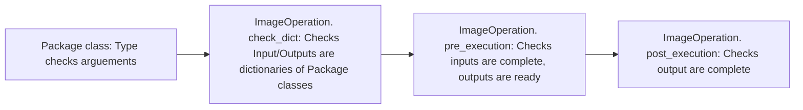
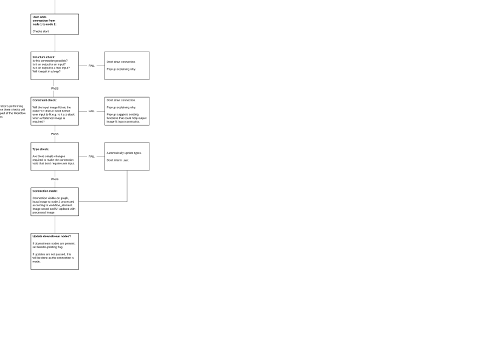

# Table of Contents

- [1. Document Changelog](#1-document-changelog)
- [2. Premise and Aims](#2-premise-and-aims)
  - [2.1 Educational](#21-educational)
  - [2.2 Intuitive](#22-intuitive)
  - [2.3 Expandable](#23-expandable)
- [3. System Backend Architecture & Class Structure](#3-system-backend-architecture--class-structure)
  - [3.1 Interaction between backend classes and frontend UI](#31-interaction-between-backend-classes-and-frontend-ui)
  - [3.2 Class Hierarchy](#32-class-hierarchy)
  - [3.3 Foundation Classes](#33-foundation-classes)
    - [3.3.1 DataType classes](#331-datatype-classes)
    - [3.3.2 Shape class](#332-shape-class)
  - [3.4 Composition classes](#34-composition-classes)
    - [3.3.1 Image Class](#331-image-class)
    - [3.3.2 Parameters Class](#332-parameters-class)
  - [3.4 Execution Classes](#34-execution-classes)
    - [3.4.1 ImageOperation Class](#341-imageoperation-class)
    - [3.4.2 ImagePackage](#342-imagepackage)
    - [3.4.3 ParameterPackage](#343-parameterpackage)
    - [3.4.4 ImageOperationDirectory Class](#344-imageoperationdirectory-class)
  - [3.5 Interface Classes](#35-interface-classes)
    - [3.5.1 Port Class](#351-port-class)
    - [3.5.2 Node Class](#352-node-class)
    - [3.5.3 Connection Class](#353-connection-class)
  - [3.6 WorkFlow Class](#36-workflow-class)
  - [3.7 Error Handling](#37-error-handling)
- [4 System Frontend and UI](#4-system-frontend-and-ui)
- [5 Development Plan](#5-development-plan)
  - [Stage 0 - Planning](#stage-0---planning)
  - [Stage 1 - Backend](#stage-1---backend)
  - [Stage 2 - Frontend](#stage-2---frontend)
- [6 Testing](#6-testing)
  - [6.1 – Backend Foundation Classes](#61--backend-foundation-classes)
    - [6.1.1 DataType](#611-datatype)
    - [6.1.2 Shape](#612-shape)
  - [6.2 – Backend Composition Classes](#62--backend-composition-classes)
    - [6.2.1 Image](#621-image)
    - [6.2.2 Parameters](#622-parameters)
  - [Stage 6.3 – Backend Execution Classes](#stage-63--backend-excecution-classes)
    - [6.3.1 ImageOperation](#631-imageoperation)
    - [6.3.2 ImageOperationDirectory](#632-imageoperationdirectory)
  - [6.4 Backend Interface Classes](#64-backend-interface-classes)
    - [6.4.1 Port Class](#641-port-class)
- [Versioning](#versioning)
- [8 Other Notes](#8-other-notes)
  - [7.1 Class design notes](#71-class-design-notes)
  - [7.2 Node design notes](#72-node-design-notes)

# 1. Document Changelog

|Date		|Version	|Changes Made		|
|:--		|:--		|:--				|
|25/08/26	|0.1.0		|Initial notes on design	|
|26/08/26	|0.2.0		|Added description of project aims|
|27/08/26	|0.3.0		|Added description of DataType classes|
|28/08/26	|0.3.1		|Added description of Shape and Image classes|
|28/08/26	|0.3.2		|Added description of Parameter, ImageOperation and ImageOperation Directory classes|
|01/09/26	|0.3.3		|Added description of backend class structure|
|01/09/26	|0.3.4		|Added description of Node, Port, Connection classes|
|01/09/26	|0.3.5		|Added description of Workflow class|
|03/09/26	|0.4.0		|Added description of UI and UI diagram|
|05/09/26	|0.5.0		|Merged in test plans|
|05/09/26	|0.6.0		|Converted to markdown document|
|05/09/26   |0.7.0      |Added type and shape conversions to description of Image|
|05/09/26   |0.7.1      |Added __iter__ to Shape class and included in unit testing|
|05/09/26   |0.7.2      |Made it explicit in description of Image class that images should always have four dimensions|
|05/09/26   |0.7.3      |Added Image.Unsqueeze to Image class description and unit testing|
|05/09/26   |0.7.4      |Added description of implicit and explicit type conversions to Image DataTypes|
|06/09/26|0.7.5|Added description of class variables to Shape and removed unsqueeze from Image classes|
|07/09/26|0.7.6|Updated description of Shape class to include new definitions of dimensions and class functions|
|07/09/26|0.8.0|Added description of Parameter unit testing|
|08/09/26|0.8.1|Added description of ImageOperation unit testing|
|08/09/26|0.8.2|Added test_sample function to documentation and unit test plans for Type classes|
|08/09/26|0.8.3|added reference to DataTypes.test_sample being given as 0sg|
|09/09/26|0.8.4|Type classes: added description of numpy class variable and changes to to_numpy functions.|
|09/09/26|0.8.5|Parameter class: added shape arguement and updated unit testing|
|09/09/26|0.8.6|Type class: clarified description of use cases of Type classes|
|09/09/26|0.8.7|Parameter Class: Updated unit testing|
|10/09/26|0.9.0|Started major re-write of description of classes, class heirarchy and type checking|
|11/09/26|0.9.1|Re-wrote description of DataType classes to explain base class/child class structure|
|13/09/26|0.9.2|Re-wrote description of Image class and Image unit testing|
|13/09/26|0.9.3|Re-wrote description of Parameter class and Parameter unit testing|
|14/09/26|0.9.4|Re-wrote description of ImageOperation class and unit testing|
|14/09/26|0.9.5|Documented run_code function in ImageOperation|
|15/09/26|0.9.6|Described refactoring of dictionary in ImageOperation to dataclasses and updated unit testing|
|18/09/26|0.10.0|Added description of error handling and logging code|
|19/09/26|0.11.0|Added detail to description of ImageOperation and flow chart|
|19/09/26|0.12.0|Added description of versioning and Changelog.md|
|22/09/26|0.13.0|Added description of LogItem in error_handling.py|
|23/09/26|0.14.0|Updated specification and unit testing for ImageOperationDirectory class|
|24/09/26|0.14.1|Updated unit testing for ImageOperationDirectory class|
|25/09/26|0.14.2|Updated unit testing for ImageOperationDirectory class import testing|
|25/09/26|0.15.0|Updated description of Port class and Port class unit testing|
|25/09/26|0.15.1|Updated Port class unit testing|
|26/09/26|0.15.2|Updated Connection class description and added class unit testing|
|27/09/26|0.15.3|Added description of ConnectionError exception to Error Handling section|
|28/09/26|0.15.4|Added description of ActivationError exception to Error Handling section|
|28/09/26|0.15.4|Updated description of Node class and added class unit testing|
|30/09/26|0.16.0|Added plans for implementation of WorkFlow class to WorkFlow class description|
|01/10/26|0.16.1|Added transpose function to description of Image class, added transpose unit testing|
|01/10/26|0.16.2|Updated description of connection class from input/output to source/target|
|01/10/26|0.16.3|Added description of permitted_conversions and warned_conersions to Type classes|
|01/10/26|0.16.4|Added description of load_image and save_image to ImageOperation files section|
|01/10/26|0.16.5|Moved description of references to UI elements from Parameter to ParameterParcel class|
|03/10/26|0.16.6|Updated description of error_handling.log to append log items to list rather than return them|
|03/10/26|0.16.7|Added description of convert() function to Image and Parameter classes and unit testing|
|06/10/26|0.17.0|Refactoring data transfer between nodes. Removed description of Image and Parameter classes|
|06/10/26|0.17.1|Added description of MissingDataError in error_handling.py|
|06/10/26|0.17.2|Refactoring data transfer between nodes. Updated description of classes and class interactions. |
|06/10/26|0.17.4|Refactoring data transfer between nodes. Updated class structure diagram. | 
|08/10/26|0.17.5|Refactoring: updated unit testing for ImageOperation | 
|09/10/26|0.17.6|Added description of data_checks.py|
|09/10/26|0.17.7|Added unit testing for data_checks.py|
|10/10/26|0.17.8|Added is_input flag description to Ports class|
|10/10/26|0.17.8|Refactoring: moved unit testing and description of transposition and conversion functions from Connection to WorkFlow classes|

# 2. Premise and Aims
Over the last 10 years, a lot of my research has been based on image analysis. I have developed my own workflows using one or a combination of FIJI, Python and C#. With the ease of high-definition microscopy at various levels, thorough, repeatable and robust image analysis is becoming more and more important – even with the advent of AI, there will always be a role for classical image analysis. However, getting into analysing your own images can have quite a high barrier to entry. This is exacerbated by some of the weaknesses in the image analysis tools mentioned above:
1.	It’s hard to compare the output to the input, particularly when stringing together multiple steps.
2.	It’s difficult to know what tools are out there – you might think you have complex needs when what you’re trying to do is a solved problem and can be done in a single step.
3.	Particularly when getting into coding for image analysis, it can be very difficult to get different functions to talk to one another. Frequently, the challenge is in understanding how to manipulate the image into the correct format and dimensions for a particular function. Once, you’ve done that, the actual analysis is simple.
With that in mind, I’ve got three main aims to this software:
1.	It needs to be educational by easing users into the image analysis tools that are available.
2.	It needs to be intuitive, with a simple UI where the same actions will always lead to the same effects.
3.	It needs to have a large, well-structured and well-documented list of functions. To aid this, it needs to be easily expandable.
This will be done by allowing the user to use drag-and-drop nodes and connections to draw an image analysis workflow. A pair of input/output images will allow immediate comparison between the original image and the changes at each step.

## 2.1 Educational
To be educational, it should not place unnecessary barriers to learning. This means things like conversions between data types and transposition of dimensions should be dealt with behind the scenes, EXCEPT where they are directly relevant to proper image analysis (for example, trying to do binary processes on non-binarised data).

Feedback should be immediate, so adding a new process into the workflow, or changing a parameter, will update the output image so the user can see its effect.

Image analysis processes will be categorised in such a way that the user can get some idea of what they do before trying them, and documented so that it’s easy to learn what they do and how they work.

You shouldn’t have to do something unrelated to image analysis (ie, learn to code) to analyse images. At the same time, it should provide the tools to develop the user’s ability to use code in image analysis. An end goal is to have the option to export the user’s image analysis workflow to functional, documented python code.
## 2.2 Intuitive

This largely comes down to the UI. It should be simple, with the more complex options present but not in the way, and focussed around the three main elements: the two image windows and the workflow.

It should have the capacity to deal automatically with data conversions that the user doesn’t need to see, while giving hints on how to fix conversions which are required to develop an understanding of image analysis (e.g., how to flatten a z-stack image, how to binarise an image).

## 2.3 Expandable

The ability for the software to organise the workflow should be independent of exactly which image analysis functions are included but should, within reason, work for any function.

This means new functions, with the correct formatting and using the correct classes, should be able to slot directly into the software simply by saving them into the correct folder.

Crucially, adding in a new function should not require messing with the UI or base code.

# 3. System Backend Architecture & Class Structure

The main image analysis workflow will be made up of a graph of Nodes connected by Connections.

Each Node will act as a hanger for code to act on the inputted image. The code will be defined in an ImageOperation class. The Node will contain a reference to the relevant ImageOperation along with input and output Ports, which cache the input and output data for each ImageOperation.

Each Port acts as an input or output for a single piece of data for a single ImageOperation. For example, if an ImageOperations requires two images and a parameter and delivers a single image, it will have three input ports and one output port. Each port has two attributes, the metadata and the data. The metadata holds the constraints and expectations of the data. For an image, this will be data type, constraints on shape (eg, is this image expected to be a single channel or a single z-slice, or does it not care), the shape mapping (which image dimensions are held in which data dimension). For a parameter, this will be the data type and any requirements for getting the parameter from the UI, if relevant. Metadata will be stored in ImageMetadata and ParameterMetadata classes. These are defined by the ImageOperation and are required on Port instantiation by a Node. Data will be passed along later, either from a Connection for an input Port or an ImageOperation for an output Port and which be checked against the metadata. Data is cached in the Port, not the connection or ImageOperation.

A connection connects an output Port of one Node to an input Port of another Node. It carries out a number of checks on the data to check it meets the expectations of the connected Port (defined by the metadata). Where possible, simple changes (type conversion and shape transposition) will be carried out on the data. If more complex changes to the data are required, the user will be prompted.

ImageOperations are the actual image analysis functions carried out by nodes. They can use existing image analysis libraries (such as scikit image) or custom functions. To allow easy expandability, each ImageOperation is held in its own file which are imported to an ImageOperationDirectory on startup. They also contain definitions of input/output data types and image shape.

To allow consistent data transfer through the workflow, a number of classes are used to define the structure of the data. These include custom DataTypes, and classes defining the image and its shape, and input parameters to ImageOperations. These are used to streamline user input and data transmission, but are not used in actual image analysis, where standard NumPy data types are used.

## 3.1 Interaction between backend classes and frontend UI

The UI is defined in more detail in the Frontend section, but the Backend interacts with the UI in a few main ways. Firstly, users drag-and-drop nodes based on their desired image analysis workflow.

Each node is associated with a given ImageOperation and the parameters of that operation are designed to allow the UI to automatically draw a dialog requesting the required information in a relevant format, without each new operation requiring adjustments to the UI.

They can then draw connections between the nodes. A single node has a defined number of inputs (defined by the ImageOperation) but can output to as many other nodes as required. On drawing the connection, the WorkFlow class checks that the connection can provide an image/value in the proper data type and shape. If so, the ImageOperation is carried out allowing immediate feedback in one of the two image views. If not, and the connection cannot carry out simple shape or type conversions, the user is warned of the problem. Where possible, this warning will provide hints towards available ImageOperations that could be used to fix the problems with the data (for example, carry out a Z-projection to flatten the image). 

## 3.2 Classes

### 3.2.1 DataType classes

The aim of the DataType classes is to allow data to be transferred through the WorkFlow in a reliable and predictable way.

Data can **only** be passed through the WorkFlow as a DataType class - equivalent types such as np.uint8 or np.float64 **will** result in type errors.

This is a deliberate design choice to maintain control and consistency in how data moves through the WorkFlow.

A distinction should be made between data transferred through the WorkFlow and data used for image manipulation in members of the ImageOperation class. Input and output data to ImageOperations will be in **defined** numpy equivalents to DataType classes. The conversion from DataType classes to their numpy equivalent will take place in the Port for each input and output. This means image analysis can be carried out using standard types and functions, and there is no requirement for data manipulation using the DataType classes. 

While image manipulation is carried out using standard Numpy types, DataTypes are still used to define the format of expected inputs to and output from ImageOperations.

The interaction between DataTypes, Ports and ImageOperations will be described in more detail in the Port and ImageOperation class descriptions.

DataTypes are all based on a defined base class, BaseType. This defines the characteristics of a custom data type with the following variables. The first three variables are required - the class types will not function without them and will fail unit testing. The remaining four variables are optional:

* data_type - this provides a reference to this DataType in the DataType enum in constant.py
* numpy - the defines the equivalent numpy data type (eg np.uint8, np.bool, np.float64)
* allowed_sub_types - a tuple of allowed data types (eg np.integers, bool, numbers.Number)

* description - text description of class and what its for
* min_value - if the value must be with a range, this defines a minimum value (default is None)
* max_value - maximum allowed value, if defined (default is None)
* is_array - type classes must define as either a 1d or multi-dimensional data type (default is False)

* permitted_conversions - these are the other DataType classes this is permitted to be be automatically converted into by WorkFlow (eg, between 8bit int and 8bit float)
* warned_conversions - these are the DataType classes this can be converted into by WorkFlow, with a prompt to the user (ie, binary image to 8 bit image - this is possible, but will likely unbinarise the image)

By default, seven custom data types are defined. Three are used to define images, two to define 1D variables and two to define non-image arrays:

* ImageInt - For images stored as integers in the range 0 ≤ int ≤ 255
* ImageFloat - For images stored as floats in the range 0 ≤ float ≤ 1
* ImageBinary - For binarised images. Stored as integer 0 or 1, will accept boolean values.

* ValueInt - For 1D integer variables
* ValueFloat - For 1D float variables

* ArrayInt - for multi dimensional integer variables
* ArrayFloat - for multi dimensional float variables

Note again that these data types are for transferring data through the WorkFlow, for example an image threshold value may be transmitted from one node to the next as a ValueInt. They are not expected to be used in any code unrelated to data transfer.

For new DataTypes, conversion between types will result in a NotImplementedError. To fix this, implement a custom to(self, dtype) function in your custom class defining the possible conversions.

By default, each ImageType can be converted to each other. Likewise ValueTypes and ArrayTypes can be converted to other members of the same type.

Where the 'to' function has been implemented, conversions can be explicit (eg, by using ImageInt.to(DataType.ImageFloat)) or implicit (eg, by calling ImageFloat(x) where x is an ImageInt).

Each Image type has __init__, value property and value.getter functions along with conversion functions for the other two image types and the relevant standard numpy type. For numpy conversion, this will be available as an explicit function (to_uint8 or to_float64) or as a generic function (to_numpy).

The comparable numpy data type is stored in the numpy class variable. This is used in the to_numpy function and for type checking once the DataType class has been converted to a standard numpy class for image analysis in a Port.

~~Each DataType includes a test_sample() function, which creates a variable of that type for testing and providing default values. This can be generated as random numbers (for testing) or 0s (for instantiating default input and output variables for ImageOperations, if zero = True - by default, zero = False).~~

All DataTypes will be wrapped in an Enum to help ensure type safety, to simplify access from other classes and to simplify refactoring if data types need to be changed in the future. Within the Enum, data types are specified into groups image_type and value_type. For each type, the data_type class variable **must** point to the relevant name in the Enum (stored in constants.py).

### 3.2.2 Shape class

This exists to hold data related to the shape of transmitted images. It will hold integer values for:
* c (channels)
* z (depth)
* y (height)
* x (width) 

The class attributes are defined in the class variable dimensions:

* dimensions- the current dimensions and default order (c, z, y, x). This is in the form of a tuple defining the order, used in the __iter__ and __getitem__ dunders below.

__init__ takes kwargs to initialise attributes. These attributes must include all the dimensions listed in dimensions and nothing else.

It contains other class variables to define limits on image Shape:

* max_image_dimensions - the max number of dimensions an image should have (4).
* min_image_dimensions - the minimum number of dimensions an image should have. This is currently set at 4, the same as max, to allow for consistent expectations for image processing. Un-used dimensions should have size 1.

Shape has __iter__ dunder to return values in the order defined above, __getitem__ and __setitem__ dunders to return and set values and __copy__ and copy() functions to allow copying. __getitem__ and __setitem__ accept and return values as either strings (c,z,y,x) or integer indices (0,1,2,3 - as defined by order in dimensions).

Shape also has functions to convert between dimensions in string and integer formats.

Shape will be used to hold shape related information in a number of classes and contexts:

* Image class – this will reflect which dimension of the multi-dimensional array holds which dimension of the image.
* ImageOperation class:
    1.	Constraints on input – does the operation need a specific shape (eg Z = 1 for a flat image) or accept any size for a specific dimension (in which case, -1 is used).
    2.	Effects on output – what effect an operation will have on the image shape, for example Z-projection will result in a Z of 1, while other dimensions will be left unchanged (-1).
* Node and Port classes – this will mirror the usage in ImageOperation classes
* Connection class – this may be required to reshape the image from the shape given by the input port to the shape given by the output port.

### 3.2.3 ImageOperation Class
The ImageOperation class is responsible for carrying out functions that carry out analysis on images. A key aim of this project is expandability and to allow the inclusion of new image analysis functions with no need to edit the base code. To achieve this, each image analysis function will be a separate file written as an instance of the ImageOperation class, containing all the information required to run the function and will be imported using imagelib. 

The previous classes described have been primarily related to the flow of data through the WorkFlow graph and have defined custom class types to make sure this happens in a controlled manner. The ImageOperation sits slightly outside this class structure, as existing image analysis modules work in standard or numpy classes. To allow ImageOperations code to be designed and executed in a standard manner, inputs and outputs from ImageOperations are in standard Numpy data types (for conversion from custom DataTypes to Numpy, see Node and Port classes).

The expected inputs and outputs will still be described in terms of DataType classes, as these classes also define their own Numpy equivalents.

The ImageOperation class will contain the following variables:

* name: name of ImageOperation (user facing)
* id: id of ImageOperation for use in code (imported based on module name)
* category: logical category (“Threshold”, “Filter” etc) - defined by folder location of file
* input and output dictionaries (note: each of these variables will be instantiated as a dictionary, either of a Package class or empty if None is passed):
    - input_image: input images as dictionary of ImagePackage class
    - input_parameter: other inputs as dictionary of ParameterPackage class         
    - output_image: Output images as dictionary of ImagePackage class
    - output_parameter: other outputs as dictionary of ParameterPackage class 
* docs – documentation to explain function, effects, parameters etc
* alerts – any warnings to user (e.g, “Background subtraction with a large radius is a very slow process”)
* version – version of software code ImageOperation was written for. This is to future proof code, so changes to base code that affect ImageOperations don’t mean all existing ImageOperations need to be rewritten. 
* execute – function with compiled code to execute - gathered from input .py files by ImageOperationDirectory

Because this class takes input directly from external files there are a number of checks made on that data:

```mermaid
graph LR
Node2["Package class: Type checks arguements"]
Node3["ImageOperation. check_dict: Checks Input/Outputs are dictionaries of Package classes"]
Node4["ImageOperation. pre_execution: Checks inputs are complete, outputs are ready"]
Node5["ImageOperation. post_execution: Checks output are complete"]


Node2-->Node3
Node3-->Node4
Node4-->Node5
```
Firstly, data on expected inputs and outputs are entered into a PackageClass, either ImagePackage for images or ParameterPackage for other input/output values. This requires a defined data type for that variable from the DataType enum. Where other parameters (the value itself, any shape parameters to define it) it will also check their type, but these aren't required until a later stage. Note that, on instantiation, the inputs and outputs will have defined data types but no actual data.

Next, ImageOperation, the setters for InputImage, InputParameter, OutputImage and OutputParameter run check_dict() which checks that each arguement is a dictionary of the relevant package class.

The bulk of the checks are carried out when run_code is called to execute the code, which calls the pre_execution function. This checks that all inputs are present and correct (eg, input image pixel array matches defined shape) and that the required output arguements are present to describe the outputs (dtype and shape).

Finally, following code execution checks are carried out to ensure that the output is complete and correct.

**NOTE: At this point, any ImageOperation requires (at least) one image as an input. This is a design decision to prevent creep and bloat, based on the idea that as soon as only non-image variables are accepted this software is moving into data analysis rather than image analysis. This is checkedby the run_code function in ImageOperation and will therefore also affect other classes interacting with ImageOperations (Nodes and WorkFlow).**

### 3.2.4 ImageOperationDirectory Class
This class holds for a list of all ImageOperation classes, along with the code required to import them.

ImageOperations are imported from a directory defined in the ImageOperationDirectory class, currently .\backend\image_operations. 
Modules in child folders of image_operations are imported, but not at greater depth. Child folders define the category of contained ImageOperations. The category name should be saved in __init__.py as category = "string".

ImageOperationsDirectory can be passed two arguements. Log provides a list of LogItem class from error_handling.py and makes up a log of error messages. If this is not passed, a new list will be created. Test (default = false) is a flag for testing ImageOperationsDirectory. If test == true, only files within image_operations/testing folder will be imported. If testing == false, files within image_operations/testing folder will not be imported.

The proper format for ImageOperation files is described in the ImageOperations Files section.

Files are first checked for any imports that are not permitted by the allowed_imports variable, currently stored in the ImageOperationDirectory class.

Files are then checked for their version, in the format "version = x.y.z". This defines the API version for which they are designed and is used to ensure the correct import function is used to keep backward compatibility.

Where a version is found, ImageOperations are imported into the ImageOperation class.

They are then tested using the core.type.sample_data function, which provides sample input data in the required format defined by the ImageOperation.
Note that, for now, inputs are provided as variables or arrays of 0s, to avoid situations where a random value may be outside a required range. However, a potential future point of failure is if 0 is not a valid value for a particular input. In future, this could be avoided by implemented min and max values to the sample_data function.

If testing is sucessful, files are added to a dictionary of ImageOperations with a key of the filename without py (**TODO: address potential failure with identical filenames**). The category and version number will be added to each ImageOperations based on file and folder parameters. 

### 3.2.5 ImageMetadata
Simple class holding metadata for image inputs and outputs in Ports. Contains:
* dtype - set at instantiation based on ImageOperation code file.
    - Type checks for member of DataType
* image_shape_constraints - set at instatiation based on shape constraints defined in code file.
    - Type checks for Shape class
* image_map - set at instantiation based on relationship between image dimensions and array dimensions required/delivered by ImageOperation. 

### 3.2.6 ParameterMetadata
Simple class holding data for non-image metadata for Ports. Includes the option to specify UI elements to fetch parameter values from the user. The aim is, where user input is required, to have the necessary information for the frontend to automatically create a dialogue box for the user to enter values, without each ImageOperation requiring its own hardcoded UI elements.

Contains:
* dtype - set at instantiation based on ImageOperation code file.
    - Type checks for member of DataType.
* shape - if dtype defines an array_type, contains a np.array defining shape of value.
    - will accept a tuple, list or np.ndarray. Tuples and lists will be converted to np.ndarray.
* user_input - boolean flag to say if value is expected via WorkFlow (False) or via (UI).
* ui_element – the desired UI element for input, where relevant (text box, drop down box, check box, slider etc) - setter checks this is present if user_input is True
* ui_element_options – Dictionary of other options related to that UI element, where relevant (slider min/max, drop down box options etc).

### 3.2.7 Port Class

The port class acts as a buffer between a Node and an ImageOperation. Its role is to hold metadata requirements of the ImageOperation and cache input or output data. There are two child Port classes:
- InputPort holds input data.
- OutputPort holds output data.

Two lists of ports are created with each node, and ports do not exist independently of nodes. Each port has the instance variables:
* node_id – unique identifier for connected node
* port_id - id for port within the node (the name of the connected ImageOperation input/output)
* is_input - flag for whether this is an input or output port
* metadata - ImageMetadata or ParameterMetadata class, holding metadata defined by ImageOperation and created at instantiation. Must be present, cannot be None.
* data - cached data. None at instantiation.

### 3.2.8 Node Class
The Node class is a hanger for an ImageOperation and its associated inputs/outputs. It is responsible for positioning an ImageOperation in the WorkFlow. There can be multiple nodes containing the same ImageOperation. On instantiation, the Node creates Ports to provide inputs and outputs to the associated ImageOperation. Data travels through these Ports to the ImageOperation; the Node class itself does not handle any data. It contains the following instance variables:

* node_id - unique identifier for this Node, created by WorkFlow on Node instantiation.
* image_operation – reference to the image analysis function to be run, as an ImageOperation class
* Various flags:
    - is_ready – whether the correct inputs have been connected allowing the ImageOperation to be run.
    - needs_update – whether this node needs to be (re)run, either because it hasn’t been run yet or because an upstream node has been changed.
* input_ports – a dictionary of members of the port class defining the required inputs to the node.
* output_ports – a dictionary of members of the port class defining the presented output(s) from the node.

On Node instantiation, the following occurs:
<ol>
<li>Create Node and node ID</li>
<li>Add ImageOperation to Node</li>
<li>Add Ports to Node based on input and output requirements of ImageOperation</li>
    <ul><li>Each port is added to either the input_ports dictionary or output_ports dictionary</li>
    <li>If the Port is for an ImageOperation input_image with name "name", its key will be "image.name"</li>
    <li>If the Port is for an ImageOperation input_parameter with name "name", its key will be "parameter.name"</li>
    <li>For each Port, its Port.port_id will be the same as its dictionary key</li>
    <li>At this point, Port's will be created with neither input/output port data nor an empty Image/Parameter/ImageParcel/ParameterParcel class structure for entering data later (as these classes can't be created empty)</ul>
</ol>
When a Node is activated, there are three steps:
<ol>
<li> Reset ImageOperation inputs and outputs</li>
  <ul><li>This is important because Nodes contain references to ImageOperations, and an ImageOperation can be shared between multiple Nodes</li></ul>
<li> Give ImageOperation inputs references to outputs from relevant Ports</li>
  <ul><li>References rather than cache to avoid data duplication where not necessary</li></ul>
<li> Run ImageOperation </li>
<li> Cache ImageOperation output to inputs of relevant output Ports</li>
  <ul><li>Cache rather than references because ImageOperations are shared and its outputs are about to be reset</li></ul>
<li> Reset ImageOperation inputs and outputs</li>

Things to test before activation:
* is the node is_ready flag true?
* is the port_id in the correct format ("type.name")
* does the input key referenced by port_name exist in ImageOperation inputs?
* does the input port contain data (pixel_array and mapping for images, value for parameters)?

Things to test after activation:
* does the output key referenced by port_name exist in ImageOperation outputs?
* does ImageOperation output contain data (pixel_array and mapping for images, value for parameters)?

### 3.2.9 Connection Class

Connections form the links between nodes and ports through which data travels through the WorkFlow. They have a defined direction, with an input and an output, and are created by the user. Before the instantiation of a connection, the WorkFlow class will check that input and output expect compatible type and shape (explained in more detail in WorkFlow class). Connections contain the following instance variables:

* source_port - a reference to the preceeding Port
* target_port - a reference to the next Port
* connection_id - unique identifier of the connection
* tranpose - default None, required for transposing an image from source_port to target_port
* convert - default None, required for converting a DataType from source_port to target_port

## 3.2.10 WorkFlow Class

The WorkFlow class does the bulk of the work in initiating, defining and checking the graph through which image data flows.

It contains lists of all existing nodes, connections and ports, contains functions to safely add, edit and remove new nodes, ports and connections.

On creation of new nodes, it interacts with the frontend to get node parameters.

On creation of new connections, it checks the validity of those connections and, if necessary, gives feedback to the user.
It defines the starting node in the graph, allowing it to generate upstream and downstream paths through the WorkFlow.
It contains instance variables:

* nodes – dictionary of all extant nodes by unique ID
* connections – dictionary of all connections by unique ID
* starting_node – ID of starting node
* max_id - current max integer ID for node/connections dictionary keys - considered uuid for this but in a centrally controlled graph like this, with only two data classes to be kept track of, integers are easily managed and result in a more human-readable dictionary for testing and error reporting purporses. 

It also contains the following functions:
* update_graph
* node_create
* node_remove
* connection_create
* connection_remove
* ~~Transpose - tranposes pixel_arrays passing through the graph, given requirements of input and output Ports. Previously part of Image class./~~
* ~~Squeeze/unsqueeze - changes array shape, as Tranpose.~~

On creation of a new connection, it will check for structure, shape or type violations. Where these can be fixed through image type or shape changes, it will do so, otherwise it will prompt the user to adjust the WorkFlow. 

### 3.6.1 Workflow Implementation

__Stage 0__
- Add permitted conversions and conversions with warnings to Types
- ~~update connection class and unit testing - it should check input port is a node_output port and output port is a node.input port~~ checked in add_connection function
- re-add transposition to Image and unit test
- update nomenclature for connections from input and output to source and target (if I'm talking about an input to a connection being the output of an output port, things get confusing)
- Update ParameterPackage with user_input flag

__Stage 1__
* Create class.
* Only arguement passed in is an ImageOperationDirectory
* This needs a setter to ensure it is of Class ImageOperationDirectory
* Two key dictionaries created in __init__
  - nodes
  - connections
* One function called from __init__
  - initialise_load_image - creates a load_image node as graph start point
* Instance variables created in __init__
  - max_id - highest value used for a node or connection id - increments each time a new node/connection is created
  - update_on_change - if True, updates whole graph every time theres a change. If False, waits for update call
  - start_node - nodes dictionary key of start node (a load image node)
* Create add_node(ImageOperation, key) function
  - this adds a key/value pair to nodes dictionary
  - dictionary key is node.ImageOperation.UniqueID
  - gets uniqueID and checks the key isn't already in dictionary
  - value is Node(ImageOperation)
* Create delete_node(key) function
  - removes node with given key from nodes dictionary
  - also removes associated connections
* Create add_connection(key, input_node, input_port, output_node, output_port) function
  - checks if a connection can be made
    - follows workflow_error_checking flow char
    - if connection is possible and compatible, create node
    - if connection is possible but simple incompatibilities, create node with relevant conversions/transpositions
    - if connection is not possible, raise error and log
  - key is connection.unique_id
  - value is Connection(key, input_node, output_ndoe, input_port, output_port)
  - calls update_graph
* Create delete_connection(key) function
  - removes connection with given key from nodes dictionary
  - calls update_graph
  
__Stage 2__
* update_graph function
  - traverse through graph (choose a traversal method)
  - update node is_ready flags
    - if all connected input nodes are ready, set ready is true
  - where is_ready is true and needs_update flag is true, update node
  - carry on traversing through graph till all nodes checked

__Stage 3__
* Once ImageOperation API is developed and key initial ImageOperations are implemented, add and test responses to incompatible connections suggesting an ImageOperation that might solve incompatibility.

Unit testing list:
* Passing non-ImageOperationDirectory to WorkFlow
* call add_node with arguement that's not a valid ImageOperation - error should be chained up and logged
* call add_node with a key thats not unique (if possible)
* check add_node adds a node
* call delete_node with an invalid key
* check delete_node removes a node
* check delete_node removes associated connections
* call create_connection with invalid connections (invalid port_id, id of soemthign thats not a port, input to conenction also input to node etc) - check errors chained up and logged
* call create_connection where a connection would fail structure checks (connecting input to input/output to output)
* call create_connection where a connection would fail structure checks(connecting to input which already has connections - NB - inputs allow 1 connection, outputs allow many connections)
* call create_connection where a connection would fail structure checks(would result in loop)
* call create_connection where a connection would fail shape checks(invalid shape input image)
* call create_connection where a connection would fail shape checks(invalid type (eg 8 bit image to binarised input))
* call create_connection where a connection would fail shape checks(invalid shape (eg needs flattened image but has z != 1))
* call create_connection where a connection would fail type checks(invalid type (eg 8 bit image to binarised input))
* call create_connection where a connection fails type checks but can be converted (eg 8 bit int to float input)
  - check conversion properly made
* call delete_connection with an invalid key
* check delete_connection removes a connection
|transpose| transpose passed not as Shape class | Type error | transpose accepted|
|convert| convert passed not as DataType class | Type error | convert accepted |
| get_output | Use get_output when no data at source_port | ConnectionError| No error|
| get_output | Use get_output when source_port contains image with no pixel_array| ConnectionError| No error|
| get_output | Use get_output when source_port contains parameter with no value| ConnectionError| No error|
| get_output | Test correct output given with no transpose or convert | Correct output given| Incorrect output|
| get_output | Test correct output given with transpose but no convert | Correct output given| Incorrect output|
| get_output | Test correct output given with convert but no transpose | Correct output given| Incorrect output|
| get_output | Test correct output given with transpose and convert | Correct output given| Incorrect output|
* note: both transpose and convert have previously been unit tested in Image and/or Parameter classes

## 3.7 Data Checking
Where checks on data are carried out repeatedly in the graph, these checks are kept in data_checking.py.

Includes functions for checking data and metadata at various points in the workflow:
    - check_metadata: checks that metadata is a dictionary with values of either ImageMetadata or ParameteMetadata types
    - check_data_dictionaries: calls check_metadata, then also checks that data is a dictionary that have associated metadata with a matching key
    - check_data: calls check_data_dictionarys, then also checks that data dictionary items match constraints of metadata

## 3.8 Error Handling

error handling.py holds functions and classes that allow reporting of errors to an external log (with the future potential to pass to a UI dialog).

It contains the LogItem class, which holds data for adding to the log. LogItem logs:
- time
- error: the BaseException class defining the error type
- message: the associtaed error message
- class_name: the class that logged the error
- function_name: the function that logged the error
- import_name: the imported ImageOperation file which caused the error. Defaults to None.

It also contains a custom function, log() that reports errors and appends the associated LogItem describing the error to a list passed to the log function.

Exception chaining will be used to log errors in the WorkFlow layer and ImageOperationDirectory, but not lower layer classes (see class heirarchy).

For now, error messages are simply printed. This will be developed to saving to a log file and user prompts as development progresses.

error_handling.py also includes custom exceptions:
* ConnectionError - for errors in WorkFlow connectivity (eg, Connection with a loose end)
* ActivationError - for errors in Node activation
* MissingDataError - for errors where data is missing when passed to/from Ports

# 4 ImageOperation files

## 4.2 Special cases - input and output

Because ImageOperation files loaded through ImageOperationDirectory must have inputs and outputs and can't import the sys module, ImageOperations for load_image and save_image (which by definition either don't have an input image or output image respectively) are stored in input_output.py and are not loaded via an ImageOperationDirectory.

Describe format of these files:
* some sort of API documentation to describe things that are not hard-coded but are best practice.
* Reference to sample files.
* Reference to testing.

Develop and reference plug-in test harness.

Plugins to make:

* Z-projection
* Select channel(s)
* Get threshold value
* Apply threshold value
* Gaussian blur
* Median blur
* Top hat filter
* Binary operations (erode, dilate, open, close, fill holes)
* Logical operations (and, or, etc)
* Measurements
* Compare intensities
* Edge detection
* Segmentation
* Watershedding

# 5 System Frontend and UI

 
1.	Input* image view
2.	Output* image view
3.	Workflow view
4.	Z-slice selector if Z-stack and mouse-over
5.	Lock the windows – if windows are locked, changes to zoom/pan on one effects the other – otherwise, can move and zoom independently.
6.	View node toggle
7.	Add connector button
8.	Node view, categorised by tabs
9.	Menu bar
10.	Channel options view toggle (allows selection of LUTs, what channels are visible etc)

*both views can be toggled to view the outputs of other nodes by clicking the node (for the output view) or shift-clicking the node (for the input view). Zoom using mouse wheel, double right clicking/left clicking. Pan by dragging and/or scroll bars. 
# 6 Development Plan
## Stage 0 - Planning
* Plan overall design.
* Plan class structure.
* Plan graph flow.
* Plan main UI elements.
* Set up project and directory structure for development and testing.
## Stage 1 - Backend
### Stage 1.1 – Backend Foundation and Composition Classes
* Plan unit testing for DataType, Shape, Image and Parameter classes.
* Implement DataType, Shape and Image and Parameter classes.
* Test DataType, Shape and Image and Parameter classes.
### Stage 1.2 – Backend Execution Classes
* Plan unit testing for ImageOperation and ImageOperationDirectory classes.
* Implement ImageOperation and ImageOperationDirectory classes.
* Test ImageOperation and ImageOperationDirectory classes.
### Stage 1.3 – Backend Interface Classes
* Plan unit testing for Port, Node and Connection classes.
* Implement Port, Node and Connection classes.
* Test Port, Node and Connection classes.
### Stage 1.4 – Backend WorkFlow Class
* Detailed planning for WorkFlow class.
* Plan implementation for WorkFlow class.
* Plan unit testing for Workflow class.
* Implement Workflow class.
* Test Workflow class.
## Stage 2 - Frontend
### Stage 2.1 – Frontend Planning
* Detailed plans for frontend from initial overview.
* Plan implementation of frontend.
# 7 Testing
## 7.1 – Backend Foundation Classes
### 7.1.1 DataType
**BaseType**
|Component  | Test  | Expected Outcome  | Undesired Outcome |
|:--        |:--    |:--                |:--                |  
|allowed_subtypes | Use test value of type where type not listed in allowed_subtypes | Type Error | No type error |
|is_array validation | Enter [1, 2] to data type expecting scalar values | Type Error | Data accepted |
|is_array validation | Enter 2 to data type expecting list values | Type Error | Data accepted |
|Array shape | Enter multi-dimensional array to type expecting multi-dimensional array | Array maintains shape | Array shape changed |
|Min/Max bounds | Enter value above max_value | Value Error | Value accepted |
|Min/Max bounds | Enter value below min_value | Value Error | Value accepted |
|to_numpy| Convert value using to_numpy function | Expected value of correct type | Incorrect value Incorrect type |
|Immutability | Modify original input list after instantiation of array data type | Value doesn't change | Value does change |
|Immutability | Modify original input np.array after instantiation of array data type | Value doesn't change | Value does change |
|Immutability | Modify original input value after instantiation of scalar data type | Value doesn't change | Value does change |
|Immutability | Modify original numpy type value after instantiation of scalar data type | Value doesn't change | Value does change |

**Every child class** 
|Component  | Test  | Expected Outcome  | Undesired Outcome |
|:--        |:--    |:--                |:--                |  
|Required class variables | Test that DataType.numpy, DataType.allowed_sub_types and DataType.data_type are not None | Test pass| Test fail |

**Every conversion of every child class**
|Component  | Test  | Expected Outcome  | Undesired Outcome |
|:--        |:--    |:--                |:--                |  
| Output type | Output type matches dtype arguement following explicit conversion using (.to(dtype))| Test pass| Test fail |
| Output type | Output type matches dtype arguement following implicit conversion (dtype(value))| Test pass| Test fail |
| Output value | Output value matches dtype arguement following explicit conversion ((.to(dtype))| Test pass| Test fail |
| Output value | Output value matches dtype arguement following implicit conversion (dtype(value))| Test pass| Test fail |
| Value drift | Carry out repeated conversions between data types| No drift in values| Drift in values |

**sample_data**
|Component  | Test  | Expected Outcome  | Undesired Outcome |
|:--        |:--    |:--                |:--                |  
|dtype checks | Input value of non DataType type    |Type error |Value accepted| 
|shape checks | Input value dtype where is_array = true but no shape passed   |Type error |Value accepted| 
|shape checks | Shape passed, but not as np.array, tuple or list   |Type error |Value accepted| 
|shape checks | Shape passed, but not as array of integers   |Type error |Value accepted| 
|type checks| Input value of DataType type | Output of expected type | Output of different type|
|shape checks | For array dtype, does output have expected shape with randomized values | Shape matches shape arguement | shape doesn't match shape arguement|
|shape checks | For array dtype, does output have expected shape with 0 values | Shape matches shape arguement | shape doesn't match shape arguement|
|value constraint check | For array dtype with min, max values, do random values conform to min and max | values conform | values out of range/value error from underlying type |
|output type checks| Check that output types match expecations for numpy = True and numpy = False | Correct outout types | incorrect output types |

### 7.1.2 Shape
|Component  | Test  | Expected Outcome  | Undesired Outcome |
|:--        |:--    |:--                |:--                |  
|init|Instantiate class with missing attribute|AttributeError: "Shape class instantiated with missing argument" | No error|
|init|Instantiate class with unexpected attribute|AttributeError: "Shape class instantiated with unexpected arguement" | No error|
|Type constraints	|Insert non integer data	|Type Error	| Type converted to correct type Wrong type ignored|
|Immutability|Input values based on variable then change variable |Values in DataType do not change|Values change|
|Itterability|Test iteration|Iteration returns correct values|Iteration returns incorrect values|
|get_item|Test getting items using either index or dimension string| returns correct values|Returns incorrect values|
|set_item|Test setting items using either index or dimension string| Sets correct values|Sets incorrect values|

## 7.2 – Backend Composition Classes

### 7.2.1 Image
|Component  | Test  | Expected Outcome  | Undesired Outcome |
|:--        |:--    |:--                |:--                |  
|Type constraints|	Use unexpected data type (not ImageInt, ImageFloat or ImageBinary)|	Type Error	| Type converted to correct type Incorrectly type data used anyway</li></ul>|
|Shape constraints	|Insert input array with more or less than min/max dimensions defined in Shape.py |Value Error	|	Wrong shape array accepted|
|Shape constraints	|Input shape data not in Shape class|Type Error	|	Wrong class ignored|
|get_image_shape() | Get image shape of various shape pixel arrays | Gives correct shape | Gives incorrect shape |
|convert| convert arguement not in image_types class | Type error | No error given |
|convert| convert test image | output of expected type | output not of expected type |
|transpose| new_shape arguement not in Shape class | Type error | No error given |
|transpose| new_shape arguement has values out of range |Value error | No error given |
|transpose|transpose test image | resulting image pixel_array has expected Shape | resulting image pixel array has incorrect shape |

### 7.2.2 Parameters
|Component  | Test  | Expected Outcome  | Undesired Outcome |
|:--        |:--    |:--                |:--                |  
|Type constraints|	Input data type not a member of DataType.value_type|	Type Error	| <ul><li>Incorrect type accepted</li></ul>|
|convert| convert arguement for array_type not in array_type class | Type error | No error given |
|convert| convert arguement for value_type not in value_type class | Type error | No error given |
|convert| convert test parameter | output of expected type | output not of expected type |

## Stage 7.3 – Backend Excecution Classes

### 7.3.1 data_checks.py
|Component  | Test  | Expected Outcome  | Undesired Outcome |
|:--        |:--    |:--                |:--                |  
|check_metadata| send metadata not as dictionary | TypeError: expected to be dictionary|No error|
|check_metadata| send metadata as dictionary but not of ImageMetadata/ParameterMetadata classes| TypeError: for metadata {}, expected values of type|No error|
|check_data_dictionaries|  data sent to function exists | ValueError: metadata present with no data: '{}'|No error|
|check_data_dictionaries|  data sent to function is a dictionary | TypeError: expected image to be dictionary|No error|
|check_data_dictionaries|  set data where resepective metadata not present | TypeError: data present with no metadata: '{}'|No error|
|check_data_dictionaries|  set data where the key in data dictionary is not present in the dictionary of metadata | ValueError: key present in data dictionary '{}' but not in metadata|No error|
|check_data\check_type|set data where the dtype does not match dtype defined in metadata|TypeError: dictionary value of incorrect type|No Error|
|check_data\check_image_shape|set image where the shape does not match shape defined in metadata|ValueError: image shape does not match metadata| No Error|
|check_data\check_parameter_shape|set parameter where shape does not exist in metadata|ValueError: no shape defined in metadata for array type parameter test.input|No Error|
|check_data\check_parameter_shape|set parameter where the shape does not match shape defined in metadata|ValueError: array shape does not match shape metadata for test.input|No Error|
### 7.3.2 ImageOperation
|Component  | Test  | Expected Outcome  | Undesired Outcome |
|:--        |:--    |:--                |:--                |  
|input_image_metadata setter| check input_image_metadata exists (input_image_metadata) | ValueError: for ImageOperation, input_metadata is required| No error|
|all metadata setters| input metadata where metadata isn't a dictionary| TypeError: expected {} to be dictionary|No TypeError given|.
|all metadata setters| input metadata where metadata is a dictionary with values of wrong class| TypeError: for metadata dictionary '{}', expected values of type|No TypeError given|
|reset_output| check outputs are set to None| outputs set to None| outputs not set to None|
|reset_input| check inputs are set to None| inputs set to None| inputs not set to None|
|run_code| call run_code with no code | RuntimeError: no code exists | No error given |
|run_code| run_code with no input_image | ValueError: metadata present with no data | No error given |
|run_code|run_code with input_parameter_metadata but no input_parameter| ValueError: metadata present with no data |No error given |
|run_code|run_code with input_parameter but not input_parameter_metadata| ValueError: data present with no metadata|No error given |
|run_code|run_code where input_image_data type doesn't match input_image_metadata|TypeError: dictionary value of incorrect type| No error given |
|run_code|run_code where input_image shape deosn't match input_image_metadata|ValueError: image shape does not match metadata| No error given |
|run_code|run_code where input_parameter_data type doesn't match input_parameter_metadata|TypeError: dictionary value of incorrect type| No error given |
|run_code|run_code where input_parameter_data shape doesn't match input_parameter_metadata|ValueError: array shape does not match shape metadata| No error given |
|run_code|run_code with no output metadata|RuntimeError: no defined outputs present for ImageOperation| No error given |
|run_code|run_code with existing output data and check it changes|Output changes|Output doesn't change |
|run_code|Code provided creates an error|RuntimeError: error executing operation |No error passed on|
|run_code|Code provided doesn't create an output|Runtime error: operation did not generate an output|No error passed|
|run_code|Code provided changes inputs|Runtime error: operation altered input values|No error passed|
#Code provided returns an image with type that doesn't match metadata
#Code provided returns an image with shape that doesn't match metadata
#Code provided returns an parameter with array type that doesn't match metadata
#Code provided returns an parameter with array shape that doesn't match metadata

### 7.3.3 ImageOperationDirectory
|Component  | Test  | Expected Outcome  | Undesired Outcome |
|:--        |:--    |:--                |:--                |  
|ImportList|Import ImageOperation with correct category| Correct category saved to ImageOperation | Incorrect category|
|ImportList|Test ImageOperation with no/incorrect version number|  ImageOperation rejected and reported | ImageOperation accepted|
|ImportList|Import an ImageOperation that should not be accepted because of missing arguements| ImageOperation rejected and logged | ImageOperation accepted|
|ImportList|Import an ImageOperation that should not be accepted because of invalid arguements| ImageOperation rejected and logged | ImageOperation accepted|
|ImportTesting|Test loading an ImageOperation with no input_image| ImageOperation rejected and logged | ImageOperation accepted|
|ImportTesting|Test loading an ImageOperation with non-functioning code (code returns error)|ImageOperation rejected and logged | ImageOperation accepted|
|ImportTesting|Test load an ImageOperation which produces an image output in the wrong format(not ImagePackage)|ImageOperation rejected and logged | ImageOperation accepted|
|ImportTesting|ImageOperation which produces a parameter output in the wrong format (not ParamaterPackage) |ImageOperation rejected and logged | ImageOperation accepted|
|ImportTesting|Test load an ImageOperation which produces an image output in the correct format with a missing pixel array|ImageOperation rejected and logged | ImageOperation accepted|
|ImportTesting|Test load an ImageOperation which produces an image output in the correct format with missing mapping data|ImageOperation rejected and logged | ImageOperation accepted|
|ImportTesting|Test load an ImageOperation which produces an image output in the correct format with incompatible shape and mapping data| ImageOperation accepted|
|ImportTesting|Test load an ImageOperation which produces a parameter output in the correct format with a missing value|ImageOperation rejected and logged | ImageOperation accepted|
|ImportTesting|ImageOperation which only produces an image output|ImageOperation accepted | ImageOperation rejected|
|ImportTesting|ImageOperation which only produces a parameter output|ImageOperation accepted | ImageOperation rejected|
|ImportTesting|ImageOperation which produces a parameter and image output|ImageOperation accepted | ImageOperation rejected|
|ImportConstraints|Import an ImageOperation with unacceptable import|  ImageOperation rejected and reported | ImageOperation accepted|
|ImportConstraints|Import an ImageOperation with acceptable import|  ImageOperation imported | ImageOperation accepted|

## 7.4 Backend Interface Classes

### 7.4.1 Port Class

|Component  | Test  | Expected Outcome  | Undesired Outcome |
|:--        |:--    |:--                |:--                | 
|port_id setter |create port without port_id | ValueError: "port_id required for port instantiation" | No error|
|node_id setter |create port without node_id | ValueError: "node_id required for port instantiation" | No error|
|is_input setter |create port without is_input | ValueError: "is_input flag not set for port" | No error|
|is_input setter |create port where is_input not boolean| TypeError: "is_input flag expected boolean" | No error|
|metadata setter | Pass in value that is not ImageMetadata or ParameterMetadata class | TypeError: "meta data expected as ImageMetadata or ParameterMetadata class" |No error|
| data setter | For scalar data, pass in data that is not of type metadata.dtype.numpy | TypeError: data passed to port with unexpected dtype; for port {self.port_id} expected {self.metadata.dtype}|No error|
| data setter | For image or array data, pass in data that is not of type np.ndarray | TypeError: data passed to port with unexpected dtype; for port {self.port_id} expected np.ndarray | No Error|
| data setter | For image or array data, pass in data that is not a ndarray of type metadata.dtype | TypeError: data passed to port with unexpected dtype; for port {self.port_id} expected {self.metadata.dtype.numpy}| No error|
| data setter | For image data, pass in a Shape arguement that is not present in Shape.dimensions* | AttributeError: dimension present in Shape.dimensions that is not a Shape arguement | No error|
| data setter | For image data, pass in data that doesn't match metadata.image_shape_constraints and metadata.image_map | ValueError: image_type passed to port with incorrect shape | No error|
| data setter | For array data, pass in data that doesn't match metadata.shape | ValueError: array_type data passed to port with incorrect shape| No error|
| data setter | Pass in data where metadata.dtype does not define dtype from DataTypes** | TypeError: port MetaData defines unexpected dtype| No error|
* this error should be impossible to generate given current structure of Shape, it will give an error from Shape class instead. Leave in case of future changes to Shape class
** This error should also be impossible to generate given current structure of Metadata classes, wil give an error from ImageMetadata or ParameterMetadata instead.
### 7.4.2 Connection Class
|Component  | Test  | Expected Outcome  | Undesired Outcome |
|:--        |:--    |:--                |:--                | 
| source_port     |source_port not Port class|Type error|source_port accepted|
| target_port |target_port not Port class|Type error|target_port accepted|

### 7.4.2 Node Class
|Component  | Test  | Expected Outcome  | Undesired Outcome |
|:--        |:--    |:--                |:--                | 
| image_operation setter     |Provide image_operation thats not ImageOperation class|Type error|Input accepted|
| port initiation     |Associate Node with ImageOperations with varying numbers of input_images and input_parameters|Total input ports equals sum of length of ImageOperation input_image and input_parameter directories Input ports have expected IDs|Incorrect number of input ports Incorrect port names|
| port initiation     |Associate Node with ImageOperations with varying numbers of output_images and output_parameters|Total output ports equals sum of length of ImageOperation output_image and output_parameter directories Output ports have expected IDs|Incorrect number of output ports Incorrect port names|
| port activation   pre-tests | Activate node where is_ready is false | ActivationError | node activates|
| port activation   pre-tests | Activate node where an input port_id is in an incorrect format (not type.name) | ActivationError | node activates|
| port activation   pre-tests | Activate node where an input port_id name does not correctly reference a ImageOperation input_image dictionary key | ActivationError | node activates|
| port activation   pre-tests | Activate node where an input port_id name does not correctly reference a ImageOperation input_parameter dictionary key | ActivationError | node activates|
| port activation   pre-tests | Activate node where an image input port does not contain pixel_array or mapping | ActivationError | node activates|
| port activation   pre-tests | Activate node where a parameter input port does not contain value | ActivationError | node activates|
| port activation   post-tests | Activate node where an output port_id is in an incorrect format (not type.name) | ActivationError | node activates|
| port activation   post-tests | Activate node where an output port_id name does not correctly reference a ImageOperation output_image dictionary key | ActivationError | node activates|
| port activation   post-tests | Activate node where an output port_id name does not correctly reference a ImageOperation output_parameter dictionary key | ActivationError | node activates|
| Data flow through | Create node with ImageOperation that passes through same image Input image at relevant input Port input Check output port output. |Output port output has exepcted dtype, shape, pixel_array and image_map | Output port has unexpected values| 
| Data flow through | Create node with ImageOperation that passes through same parameter Input parameter at relevant input Port input Check output port output. |Output port output has exepcted dtype, shape and value | Output port has unexpected values| 
| port activation   post-tests | ~~Activate node where an ImageOperation output_image does not contain pixel_array or mapping~~ | ActivationError | node activates|
| port activation   post-tests | ~~Activate node where an ImageOperation output_parameter does not contain value ~~| ActivationError| node activates|
* final two unit tests removed because this situation raises an error in ImageOperation which will result in it failing at the import stage

# 8 Versioning

Versioning and changelogs are implemented using the "keep a changelog" 1.1 format (https://keepachangelog.com/en/1.1.0/).

This is unit tested for __version__ existing in __init__.py in the core directory, and that the version number complies with semantic major.minor.patch versioning.

For now, version checks within the code are limited to the ImageOperationDirectory class, which checks the version number in imported modules to use import code that corresponds to the ImageOperation class structure at that defined version.

## 9 Other Notes
* Changes to image shape should always be explicit, never incidental. For example, z-projection will reduce z dimension to 1 because that’s what z projection does, but thresholding a 5 slice z-stack will output 5 thresholds, not just 1.
* Function code does not deal with type changes, checking of types, displaying images, UI input. The role of each function is purely to take its defined input, process it according to the supplied parameters, and produce an output in defined shape. As part of this role, it should include error handling to minimise/deal with possible errors (with the assumption that the input is of the required format). 
* To allow for simple additions of new functions without affecting the base code, each function will be in a separate module. Along with the code itself, this module should include other data required to integrate into the software (definitions of parameters required, input and output data types, input and output image shape) and documentation (what the function does, how it affects the image shape, how changes to parameters affect output, any other points of interest). 
* Type checking etc will be carried out by the pipeline functions, along with checking that the input and output image shapes are as expected.
* Functions can have multiple outputs, but defined inputs. For example, a z-stack could have one output getting z-projected, another getting processes slice by slice etc, but two images could not enter the same z-projection function. Some functions may require multiple inputs, eg applying a threshold will require thresholds and an image to apply thresholds to.
* Some thought is going to have to be given to how to deal with segmented images. Are segments treated as an image of size y * x with integer values defining segment locations? Is each segment treated like its own sub-image (like channels or z-slices)? Is a segmented image treated as the original image with an added layer defining the segments? Leaning towards the first option, but the other options may have advantages in specific situations.
* Some type changes should be dealt with automatically (ie, int to float). Some type changes should be highlighted to user as a flaw in the workflow (ie, trying to carry out a binary process on a non-binarised image) with pointers on how to fix the issue).
* It should be possible to add new functions without programming new UI elements. The data included with a function must be sufficient to automatically generate a UI element for the user to enter the required parameters.
* If its educational, it needs documentation. Consider whether this should be included as a string within any new function or as a separate file.
* The UI should be unintimidating. Consider what is necessary to see (input image, output image for comparison, channel and slice controls, current workflow diagram) and what can be hidden except when needed (LUTs, adding functions, changing function parameters, defining channel image parameters (channel names etc)).
* One of the challenges of image analysis I would like to simplify here is making sure an input image to a function is in the right format. Transposition of shape (eg, 3*1024*1024 image to 1024*1024*3 image) and data type (int to float) will be handled automatically. The user will be responsible for making sure a function that requires a 1*1024*1024 image doesn’t get sent a 3*5*1024*1024 image. For this to be intuitive, each function must have a clearly defined and invariable effect on image shape (eg, z-projection will reduce Z to 1. Isolating a channel will reduce channels to 1 or conversely, z-projection won’t affect channels so channels in = channels out). This allows the user to clearly see what effect each function has on the shape of the image, and also allows the software to give pointers (ie, if the user is trying to squeeze a 3 * 1024 * 1024 image into a function that requires a 1 * 1024 * 1024 image, or an integer image into a function that requires a binarized input, highlight potential functions that can be used to fit the image to the required shape).
* Implement a “pause updates” button – if the node graph gets big, make it possible to update multiple nodes then update all the images, rather than doing it repeatedly.

